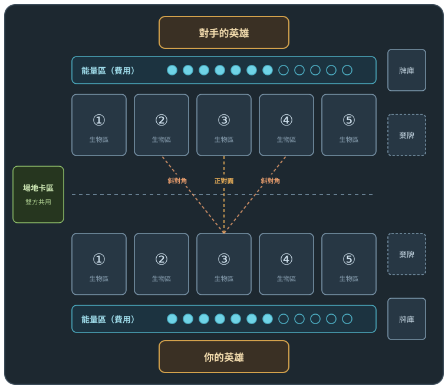

# 卡牌遊戲設計文件

> 狀態：**大縮模實驗分支**（`claude/hearthstone-scale`），以 v0.8 為基礎改成爐石式的攻擊與數字｜規則引擎已實作（全部 183 個測試）｜最後更新：2026-09-26

一款線上對戰卡牌遊戲。骨架來自寶可夢卡牌（進化、血量比例），能量與英雄的做法參考爐石
和海賊王卡牌，顏色系統參考魔法風雲會：每位玩家有自己的能量池，召喚、技能、法術全部從池裡付費；
每位玩家有一名英雄，英雄的顏色決定牌組能放哪些卡，英雄被打倒就輸。

---

## 大縮模實驗（這個分支）

試試看改成跟爐石差不多的模型會不會比較好玩：生物有攻擊力，數字跟爐石一樣（攻擊 = 費用、HP = 費用 + 1）。
一開始縮得比較小（攻擊 ⌈費用 ÷ 2⌉、HP ⌊費用 ÷ 2⌋ + 2），回饋覺得縮太多，改成現在這樣。
**這一節與上面的「已確定的規格」跟後面 v0.8 的規則不同的地方，以這兩節為準**；沒提到的（能量、場地區、進化、英雄進化）照舊。

### 牌組

- **30 張**，同名卡最多 **2 張**，**UR 最多 1 張**（v0.8 是 40 張、同名 3 張）。
- **最多進化一次**。進化線建議照 **2/2** 帶：基礎 2 張、進化 2 張。電腦的牌組與組牌畫面的自動組牌都照這個帶。
  原本的二階進化（熾天使、深海水母皇、死亡騎士、九尾天狐、古樹熊神）改成單獨的基礎生物，技能照留。
  它們的技能是照二階的預算做的，太強，所以**數值照 R（不拿 SR/UR 多的數值），技能貴 1 費、效果略減**。
- 9 費以上的卡建議 2 張以內，自動組牌也最多帶 2 張。

### 攻擊與技能

- 每隻生物有**攻擊力**和 **HP**。網頁上 HP 滿的是綠色、受過傷的是紅色。
- 每隻生物每回合可以**攻擊一次**，也可以**發動一個技能一次**，兩個都做也行，順序不限：
  - **攻擊**：不花能量，**只打得到正前方與左右兩個斜對角**（邊邊的格子只有兩格）的生物。那幾格**只要有一格空著，
    就能從空格打到後面的英雄**；全被擋住就打不到英雄。打生物時，**對方同時用牠的攻擊力反擊**；打英雄不會被反擊。
  - 一開始做成「三格全空才打得到英雄」（跟位置技能一樣），模擬出來對局拖到 8–12 分鐘、快攻英雄勝率掉到 30% 多，所以改成現在這樣。
  - **技能**：花能量，**不會被反擊**。
  - 原本是「攻擊或技能選一個」，但技能都要花能量，選技能就等於白白放棄一次免費的攻擊，所以改成各一次。
- **休息技能**：標「休息」的技能**不花能量**，但這回合**還沒攻擊**才能用，用了這回合就不能攻擊。
  給挑釁、增益這類「這回合不打、換別的好處」的效果：縮殼、挑釁、守護、磨刀、年輪、扎根、聖盾。
- 召喚當回合不能攻擊、不能發動技能（【速攻】例外）。
- **進化卡都有速攻**：召喚當回合就能進化，進化完馬上能攻擊或發動技能（不然進化要多等一回合，很虧）。
  已經攻擊或用過技能的生物，進化後不會多一次。
- **挑釁**：攻擊範圍裡有挑釁中的生物時，只能攻擊牠；挑釁的生物不在範圍內就不受影響。技能的挑釁規則照舊。
- 攻擊範圍讓格子位置有意義：擋在前面的生物保護英雄，放在邊邊的生物比較難被打到，也比較難打到別人。
- 被攻擊的一方就算麻痺、沉默也會反擊，反擊不算牠的行動；**虛弱的不會反擊**。攻擊力 0 的生物不能攻擊，反擊也是 0。
- **一回合可以進化很多隻生物**，沒有次數限制；同一隻最多進化一次（沒有第二階）。
- **攻擊加成**（增益指示物、道具、場地卡、英雄被動）只加在攻擊與反擊上，**技能傷害就是卡上的數字**。
- 減傷擋得住攻擊與反擊；吸血在攻擊、反擊、技能造成傷害時都會回復英雄。

### 種族

每隻生物有一個種族，每個種族有一個天生的特色。沉默時種族特色跟卡上其他效果一樣失效；進化線上的卡同一個種族。

| 種族 | 特色 | 生物 |
|---|---|---|
| 人類 | **同袍**：我方場上有其他人類時 ⚔ +1 | 騎士、祭司、法師、傭兵、士兵（19 種，白色最多） |
| 野獸 | **猛撲**：召喚當回合就能攻擊生物（不能打英雄） | 狼、狐、熊、鹿、蜘蛛、水母、電鰻、深海巨妖（18 種） |
| 亡靈 | **不死**：第一次被打倒時留下 1♥（消滅不算打倒） | 骷髏、死亡騎士、腐朽之王、影噬魔、深淵吞噬者 |
| 元素 | **元素之力**：技能與進場效果的傷害 +1 | 湧泉精靈、炎之小鬼、炎魔、山嶺巨人、大地泰坦 |
| 植物 | **扎根**：你的回合開始時回復 1♥ | 樹苗守衛、藤、苔蘚精靈、藤蔓巨像、萬年樹人 |
| 龍 | **龍鱗**：不會中異常狀態（同一張卡的其他效果照樣結算） | 星界巨龍、海龍、遠古巨龍 |
| 構造體 | **堅固**：受到的傷害 −1 | 過載石像、石像鬼、攻城巨像 |
| 天使 | **光輝**：召喚時你的英雄回復 3♥ | 熾天使、聖光使者、天使長、光之巨神 |

- 特色都很小，數值沒有另外扣；照模擬調英雄 HP。
- 之後可以做「種族相關」的卡：例如「我方每有一隻野獸，⚔ +1」、「召喚一隻亡靈時抽 1 張」，讓組牌多一個方向。

### 異常狀態

| 狀態 | 效果 | 持續 | 顏色 |
|---|---|---|---|
| **中毒 N** | **施放者的回合結束**時失去 N HP（不算傷害，減傷擋不住；再中一次數字相加） | 被擊倒或進化 | 黑 |
| **灼燒 N** | **施放者的回合結束**時受到 N 傷害（算傷害，減傷擋得住；再中一次取大的） | 被擊倒或進化 | 紅 |
| **麻痺** | 不能攻擊、不能發動技能 | 到擁有者的下一個回合結束 | 藍 |
| **沉默** | 不能發動技能，**卡上的效果失效**（吸血、再生），**已發動在牠身上的效果消失**（增益指示物、挑釁）；攻擊照常 | 同上 | 白 |
| **虛弱** | 不能攻擊，**也不會反擊**；技能照常 | 同上 | 綠 |

原本有七種，太多了，改成這五種：拿掉繳械（併進虛弱）、詛咒，虛弱從「攻擊減半」改成不能攻擊也不能反擊。

- **觸發時間統一**：中毒、灼燒都在**施放者的回合結束**時發作（先中毒、再灼燒）。異常狀態只能中在對手的生物上，
  所以就是「你的每個回合結束時，你施放的中毒、灼燒發作」，施放的那回合就會先扣一次。
- 中毒與灼燒一樣都是扣血，回復與再生補得回來；差別是中毒不算傷害（減傷擋不住）、再中一次數字相加。
- **沉默**跟爐石一樣：增益指示物與挑釁直接拿掉，沉默結束也不會回來。拿掉 HP 增益不會讓牠死掉——
  目前的 HP 超過新的上限才壓到上限，沒超過就不變。吸血、再生只在沉默期間失效。道具給的數值不受影響，但道具給的技能一樣不能用。
- 進化一樣解除全部異常狀態。
- 原本用到繳械、詛咒的卡：聖光使者的進場與噤聲（原本的繳械法術）改成沉默；咒術巫婆的咒縛改成中毒 1；衰敗詛咒改成中毒 3；
  絞殺藤的纏繞（虛弱）變強了，從 1 費改成 2 費。

### 卡牌

- **技能數照稀有度**：N 沒有技能（只有數值）；R、SR 一個技能；只有 UR 有兩個技能。
- **無色卡比有顏色的卡弱一點**：同費用、同稀有度少 1 點數值。
- **看牌庫頂選牌**：潮汐占卜（藍 4 費）翻開牌庫頂 4 張、選 2 張加入手牌，其餘照順序放回牌庫底；
  翻開的牌只有自己看得到，對手只看到你拿了幾張。另外有知識洪流（藍 5 費抽 3）；綠色的豐收儀式從 4 費改成 3 費。
- **衍生物（token）**：只能由效果召喚、不能放進牌組，放在自己最左邊的空格，召喚當回合一樣不能攻擊；
  被擊倒或退場就消失，不進棄牌區。先只給白色：士兵（⚔2 ♥2）、集結號令（4 費召喚 2 隻）、騎士隊長（5 費，進場帶 1 隻，技能再叫 1 隻）。
- **能量上限 −X（自己付）**：另一種費用，發動時自己的能量上限 −X，不用花能量。能量上限不到 X 就不能發動；
  這回合的能量超過新的上限就壓到上限。能量上限之後照常每回合 +2、最高 12，所以前期代價大、後期接近免費——
  效果給得比同樣能量的強一點（例如 −2 對任意目標打 4，一般要 3 能量）。卡面寫成「燃命（能量上限 −2）」。

| 生物 | 顏色 | 費用 | 技能 |
|---|---|---|---|
| 湧泉精靈 | 藍 R | 2 | 湧泉（能量上限 −2）：抽 2 張 |
| 焚身狂徒 | 紅 R | 3 | 燃命（能量上限 −2）：任意目標 4 傷害 |
| 血祭術士 | 黑 R | 4 | 血祭（能量上限 −3）：只打生物 6 傷害 |
| 過載石像 | 無色 R | 5 | 過載（能量上限 −2）：自身 +3/+3 |
| 虛空學者 | 藍 SR | 6 | 虛空奔流（能量上限 −4）：對手每隻生物 2 傷害 |
| 深淵吞噬者 | 黑 UR | 8 | 深淵獻祭（能量上限 −5）：任意目標 7 傷害；深淵之觸（5）：只打生物 7 傷害 |

- **道具可以給技能**：裝上的生物多一個技能，排在自己的技能後面，一樣跟攻擊合計每回合一次。
  範例：長弓（無色，射擊 1 費打 1）、聖徽（白，祈禱 1 費回復 3）、冰霜法杖（藍，冰凍 2 費麻痺）。
- **每個顏色有自己的場地卡**，效果只作用在自己身上：

| 場地 | 顏色 | 費用 | 效果 |
|---|---|---|---|
| 聖域 | 白 | 3 | 你的回合開始時，英雄回復 3 |
| 知識之泉 | 藍 | 4 | 你的回合開始時多抽 1 張 |
| 腐沼 | 黑 | 5 | 你的回合開始時，對手每隻生物失去 1 HP；吸血：失去多少，你的英雄就回復多少 |
| 燎原戰鼓 | 紅 | 3 | 我方每隻生物攻擊 +1（不加技能傷害） |
| 守護聖壇 | 綠 | 4 | 我方每隻生物 HP 上限 +2（原本是無色 3 費 +2） |

### 數值基準

生物照**總費用**（進化生物是基礎加進化的費用）：

| 費用 | 1 | 2 | 3 | 4 | 5 | 6 | 7 | 8 | 9 | 10 | 11 | 12 |
|---|---|---|---|---|---|---|---|---|---|---|---|---|
| 攻擊（= 費用） | 1 | 2 | 3 | 4 | 5 | 6 | 7 | 8 | 9 | 10 | 11 | 12 |
| HP（= 費用 + 1） | 2 | 3 | 4 | 5 | 6 | 7 | 8 | 9 | 10 | 11 | 12 | 13 |

- 跟爐石的白板（M 費 M/M+1）一樣。能量每回合 +2，所以同一個回合場上的數字大約是爐石的兩倍，英雄 HP 也跟著大約兩倍。
- 稀有度：N 照基準；R 照基準、多一個技能；SR 多約 2 點 HP；UR 多約 3 點數值、兩個技能。
- 進場效果、速攻、吸血、再生扣 1 點左右；9 費以上的進場效果不扣。進化卡天生的速攻不扣。
- 原本是二階、改成基礎生物的五張：數值照 R，技能貴 1 費、效果略減（它們的技能是照二階的預算做的）。
- 單體傷害（技能與法術共用）：**任意目標 = 費用 + 1，剛好解掉同費用的生物**；只打英雄、只打生物、位置 = 費用 + 2。
  範圍約費用的一半。詳見[數值基準](#數值基準)。
- 回復、增益、道具、中毒與灼燒大約是縮小版的兩倍（中毒、灼燒 2，道具 1 費 +2/+2）；
  場地卡照指定的數字（燎原戰鼓攻擊 +1、守護聖壇 HP +2）。

### 英雄

**基礎五色**：每個人都有，一個顏色一個。

| 英雄 | 顏色 | HP | 效果 |
|---|---|---|---|
| 無名劍士 | 白 | 50 | 被動「劍士之道」：我方生物 ⚔ +1；我方生物攻擊時，正前方與斜對角都被擋住也打得到英雄 |
| 深海先知 | 藍 | 55 | 天生技 預見（能量 3）：抽 1 張 |
| 冥府祭司 | 黑 | 44 | 天生技 蝕心（能量 4）：對手隨機棄 1 張 |
| 烈焰領主 | 紅 | 66 | 天生技 燃燼（能量 1）：任意目標 1 傷害 |
| 林海之王 | 綠 | 54 | 天生技 萌發（能量 3）：能量上限 +1 |

**UR 英雄**：雙色以上的英雄是 UR，要從卡包抽到（每包的 UR 可能開到英雄），或用 3 張 UR 兌換卷換；已經有了再開到換成 UR 兌換卷。
技能盡量不跟別的英雄重複：

| 英雄 | 顏色 | HP | 效果 |
|---|---|---|---|
| 翠林聖女 | 白綠 | 58 | 被動「豐饒」：我方生物 ♥ 上限 +1（原本林海之王的） |
| 潮影雙生 | 藍黑 | 36 | 天生技輪流：潮之面（能量 3）抽 1 張，用完變成影之面（能量 4）對手隨機棄 1 張，再變回來 |
| 虹彩賢者 | 五色 | 43 | 天生技 稜光（能量 3）：我方每隻生物 +1/+1 |

- 天生技都**沒有次數限制**。引擎還支援每局次數（`uses`），目前沒有英雄用。
- 英雄進化（都是 **UR**，所以牌組只能放 1 張；6 費左右、HP +9～11）：

| 英雄進化 | 由誰進化 | 費用 | HP | 進場 | 天生技換成 |
|---|---|---|---|---|---|
| 無名劍聖 | 無名劍士 | 6 | +9 | 我方生物 +2/+2 | 劍意（2）：我方生物 +3/+3 |
| 深淵大賢者 | 深海先知 | 6 | +10 | 抽 2 張 | 洞見（2）：抽 1 張 |
| 冥府之主 | 冥府祭司 | 6 | +10 | 對手每隻生物中毒 2 | 奪心（3）：對手隨機棄 1 張 |
| 烈焰君王 | 烈焰領主 | 6 | +9 | 對手每隻生物 2 傷害 | 煉獄（2）：任意目標 3 傷害 |
| 萬木之王 | 林海之王 | 5 | +11 | 能量上限 +1 | 萬木生長（3）：能量上限 +1、抽 1 張 |
| 潮影君主 | 潮影雙生 | 6 | +11 | 對手隨機棄 2 張 | 深淵低語（3）：對手隨機棄 1 張、抽 1 張 |

  翠林聖女、虹彩賢者還沒有英雄進化卡（多色英雄的技能之後一起設計）。
- 規則引擎也支援「只在我方回合」或「只在對方回合」生效的被動，目前的英雄沒有用到。

HP 的起點是 55 − 3 ×（顏色數 − 1）− 效果強度，再照英雄對戰的模擬調，目標是**每個英雄對其他英雄的平均勝率都在 45%–55%**。
攻擊範圍與種族加進來之後，快攻英雄變弱、對局變長，抽牌棄牌這類累積優勢的英雄變強，只調 HP 調不平，所以：

- **無名劍士的被動多了「突破」**：他的生物被正前方與斜對角擋住也打得到英雄（其他英雄沒有），這是快攻打穿位置的辦法。
- **削弱藍黑的控場卡**（卡牌影響分析裡，潮影雙生帶了這些卡勝率高 6–12 個百分點）：影噬魔的蝕魂 3 → 4 費、
  虛空學者的虛空奔流 3 → 2 傷害、深海巨妖的纏繞 4 → 5 費、深淵吞噬者的深淵獻祭能量上限 −4 → −5。
- 英雄進化改成 UR（牌組只放 1 張），無名劍聖的劍意改成 +3/+3 之後，無名劍士偏強，HP 調到 52；烈焰領主調到 66。
- 英雄進化加的 HP 是 9–11。

### 單卡強度

每張卡的勝率（所有英雄對戰裡，帶了這張卡的牌組贏的比例）也要在 **45%–55%**。用 8400 局英雄對戰量，
一開始 120 張裡有 4 張超出，都是太強，沒有太弱的：

| 卡 | 原本 | 改成 | 之後 |
|---|---|---|---|
| 古樹熊神（UR 綠 8） | 60.3%：8/8 吸血，森之怒（6）6 傷害 +1/+1、大地震（7）全體 3 | 6/9、再生 2（拿掉吸血：吸血連技能傷害都回血），森之怒（7）5 傷害、大地震（7）全體 2 | 約 55% |
| 大地泰坦（UR 綠 12） | 56.0%：14/15，進場全體 2、地裂（6）全體 3 | 13/14，進場全體 1、地裂全體 2（元素再 +1） | 範圍內 |
| 山嶺巨人（SR 綠 10） | 56.0%：山崩（6）全體 3 | 山崩全體 2（元素再 +1） | 範圍內 |
| 深淵吞噬者（UR 黑 8） | 55.8%：9/11，深淵獻祭 7 傷害、深淵之觸（5） | 7/9，深淵獻祭 6 傷害、深淵之觸（6） | 範圍內 |
| 深海巨妖（SR 藍 9） | 調完上面之後 55.1% | ♥ 12 → 11 | 範圍內 |

綠色的大生物特別強，因為林海之王的「萌發」能提早把牠們放出來；山嶺巨人、大地泰坦又是元素，範圍傷害多 1。

### 模擬結果

用 `npm run sim` 跑了 70000 局（每組 2000 局、英雄對戰每組 1000 局，30 張牌組、最多進化一次、進化線 2/2），
完整數據在 [balance-results.md](balance-results.md)。時間的估法跟 v0.8 一樣，另外每次攻擊算 3 秒。
目標：**先後攻、每個英雄、每張卡的勝率都在 45%–55%**。

| | 現在 | 還沒調之前 | v0.8 |
|---|---|---|---|
| 英雄對其他英雄的平均勝率 | **47.8% – 52.2%** | 41.0% – 57.1% | 46.6% – 54.8% |
| 先攻勝率（三種打法） | **53.3% – 53.6%** | 54.3% – 56.5% | 51.6% – 53.0% |
| 先攻勝率（英雄鏡像） | **46.9% – 54.9%** | 49.4% – 56.6% | — |
| 單卡勝率在 45%–55% 的卡 | **120 張全部**（古樹熊神約 55%，最接近上限） | 116/120 | — |
| 基準英雄的預估時間（中位數） | 7.2 分（55 HP） | 7.2 分 | 6.7 分（35 HP） |
| 落在 5–10 分鐘 | 89% | 88% | 78% |
| 牌庫抽完的對局 | 2.3% | 2.7% | 0.3% |

| 英雄 HP（模擬英雄） | 35 | 45 | **55** | 65 | 75 |
|---|---|---|---|---|---|
| 預估時間（中位數） | 5.7 分 | 6.4 分 | **7.2 分** | 7.8 分 | 8.5 分 |
| 落在 5–10 分鐘 | 72% | 88% | **89%** | 83% | 74% |

| 英雄 | HP | 鏡像先攻勝率 | 平均攻擊次數 | 預估時間（中位數） | 對其他英雄 |
|---|---|---|---|---|---|
| 烈焰領主 | 66 | 54.9% | 14.4 | 8.0 分 | 52.2% |
| 無名劍士 | 50 | 46.9% | 19.8 | 4.9 分 | 52.1% |
| 翠林聖女（UR） | 58 | 52.1% | 27.1 | 7.4 分 | 51.4% |
| 深海先知 | 55 | 48.4% | 26.0 | 10.3 分 | 50.5% |
| 潮影雙生（UR） | 36 | 50.6% | 19.9 | 7.9 分 | 49.2% |
| 冥府祭司 | 44 | 50.9% | 19.2 | 7.6 分 | 48.9% |
| 虹彩賢者（UR） | 43 | 50.8% | 16.5 | 6.5 分 | 47.9% |
| 林海之王 | 54 | 47.0% | 24.7 | 7.8 分 | 47.8% |

1. **英雄、先後攻、單卡都在 45%–55%**。先攻原本 54%–57%，後攻第一回合多 1 點能量之後降到 53% 左右。
2. **對局時間**：55 HP 有 89% 落在 5–10 分鐘。深海先知的對局最長（10.3 分），無名劍士最短（4.9 分，他的生物打得穿位置）。
3. 牌庫抽完的對局 2.3%，對局變長之後比 v0.8 多，還不算問題。
4. 電腦只看一步，不太會算「擋位置」這種佈局，真人打起來位置的影響可能更大。

---

## v0.8 變更

相對 v0.7：

- **拿掉即時回應**：對手的回合就是等他打完，沒有要做的決定。每個動作宣告就結算，沒有連鎖、
  沒有「要不要回應」的等待。原本的瞬發牌都改成一般的牌；瞬發原本估 +1 能量，
  所以大多補回 1 傷害或少 1 費（灼熱射線例外，紅色已經夠強）
- **烈焰君王的傷害各少 1**：進場對手每隻生物 3 → 2，天生技煉獄 4 → 3
- **綠色多了回血**：新關鍵字**吸血**（技能造成多少傷害，英雄就回復多少）與**再生**（回合開始時回復），
  林海之王的被動多了再生 1，萬年樹人再生 3、古樹熊神吸血；新卡吸血藤、苔蘚精靈、森林之息（全體回復）
- **山嶺巨人**的進場原本是能量上限 +1，但打得出 10 費時下回合就到上限 12 了，沒有用；改成我方英雄與每隻生物回復 8
- **更多解場的牌**：新效果**消滅**（不看 HP，直接送進棄牌區），暗殺（黑 6）、放逐（白 7）；
  另外照法術表加了冰川裂縫（藍 5，只打生物 13）、獵殺（綠 4，只打生物 11）、捕獸夾（無色 2，只打生物 6）
- **補強弱的英雄**：潮影雙生 28 → 32 HP、多一個被動「暗流」（我方生物技能傷害 +1），潮影君主加的 HP 6 → 8；
  虹彩賢者 23 → 29 HP、多一個天生技「稜光」（2 費抽 1）
- 英雄對戰的模擬裡，五個英雄對其他英雄的勝率從 31.8%–75.8% 拉近到 46.6%–54.8%（見[平衡模擬](#平衡模擬)）；拿掉即時回應後先攻稍微有利一點（52%–53%）
- **沉睡改成只有一回合**：跟麻痺一樣到擁有者的下一個回合結束，受到傷害就提早醒來（原本最多 2 個回合）。
  白色的沉睡牌各少 1 費補回來（安眠 1、催眠 2、催眠之光 2），無名劍士 35 → 38 HP
- 潮影雙生的天生技「低語」2 費改成 4 費
- **卡面的費用一律寫成「能量 N」**：生物、進化、法術、道具、場地、英雄進化、技能、天生技都一樣
- 範例卡 88 → 96 張

## v0.7 變更

相對 v0.6：

- **即時回應**：瞬發法術與【瞬發】技能、每次宣告後的回應時機、連鎖後打出的先結算、
  宣告回合結束時最後一次回應；對手沒存能量就不用等。v0.8 拿掉了
- **異常狀態**：規則引擎已實作（見[異常狀態](#異常狀態)）
- **一局 5–10 分鐘**：英雄基準 HP 從 **50 降到 35**，公式改成 35 − 3 ×（顏色數 − 1）− 效果強度；
  英雄進化加的 HP 也照比例縮小。平衡模擬新增對局時間的估算（見[平衡模擬](#平衡模擬)）
- **法術表修正**：只打生物的法術至少比任意目標多 1（4–6 費原本追平甚至反過來）；湮滅 10 → 11
- **範例卡擴充到 88 張**：每個顏色 14–16 張、無色 8 張，單色英雄組得出正式的 40 張牌組；
  每個顏色都有一條進化線、自己的異常狀態、瞬發牌
- **新增 12 張 9–12 費的高費卡**：每個顏色 2 張、無色 2 張，9、10、11、12 費都有；
  每個英雄都拿得到 9 費以上的卡。高費生物的進場效果給得比較大方（見[數值基準](#數值基準)）
- **HP 減半也可以作用在對手每隻生物**（萬物凋零）
- 自動組牌（電腦的牌組、組牌畫面的隨機補滿）9 費以上的卡最多帶 3 張
- 綠色原本幾乎只能打生物，單色對戰常常打到牌庫抽完；林鹿、苔甲巨蜥、萬年樹人改成位置技能，
  林語德魯伊改成任意目標
- 治癒之光改成回復 4、抽 1 張
- **抽牌的標準改成 3 費抽 2**：靈感、潮汐知識、深海呼喚從 2 費改成 3 費
- **生物可以退場**：自己的回合把自己的生物送進棄牌區，空出格子
- 新增跳費卡：大地脈動（4 費，能量上限 +2）、豐收儀式（4 費，能量上限 +1、抽 1 張）
- **道具加強**：新的道具預算是 1 費 ≈ HP 上限 +4；旅人斗篷 1 費 HP +4、利爪加 HP +1、鐵甲加 HP +3
- **異常狀態可以作用在對手每隻生物**（例如毒霧：對手每隻生物中毒 2）
- **新增 13 張卡**：進場施加異常狀態的生物、全體異常狀態的法術、瞬發的中毒與麻痺、新道具
- **網頁版一個畫面放得下整個牌桌**：生物格跟著視窗高度縮放，視窗矮就自動用小卡牌；
  也有「縮小／放大卡牌」與「全螢幕」按鈕
- **英雄進化卡可以有進場效果**，像爐石的英雄卡；四張英雄進化卡都有，新增潮影雙生的「潮影君主」。
  烈焰君王的天生技從打 3 改成打 4；紅色的焰狐王、九尾天狐多了進場效果
- **網頁試玩版可以自己組牌**，雙方的牌組都照正式規則（40 張、同名 3 張、顏色限制）
- **兩人連線對戰**：`npm run server` 開伺服器，開房間、把邀請連結傳給朋友就能對打（見 README）。
  連線時沒有能用的瞬發牌會自動不回應，但會等一段不固定的時間，對手看不出你手上有沒有瞬發牌
- 數值基準新增異常狀態與瞬發的估價

---

## 已確定的規格

這一節是目前的規格（爐石式的攻擊與數字）。v0.8 以前的規格見 git 歷史與 PR 分支。

**定位**
- 線上對戰遊戲，**TypeScript**
- 骨架來自寶可夢卡牌（進化、能量），生物的打法跟數字像爐石：**攻擊力 + HP**，每回合可以免費攻擊
- 生物的基準：**攻擊 = 費用，HP = 費用 + 1**（進化生物用總費用算）；英雄大約 **40–55 HP**
- **一局大約 5–10 分鐘**
- 生物的模型不要太爆：**一張同費用的法術要能解掉一隻同費用的生物**，不然大家只帶生物就好

**場上**
- 每位玩家有 **5 個生物區**、**1 個英雄區**、**1 個自己的場地區**
- 生物召喚後**不能移動**，除非卡牌效果；沒有撤退
- 自己的回合可以讓自己的生物**退場**：連同道具送進棄牌區，空出格子給新的生物，不花能量

**開局與牌組**
- 牌組 **30 張**，同名卡最多 **2 張**，**UR 最多 1 張**
- **開局前選好英雄**，雙方先看到對手的英雄，再決定起手
- 進化線建議照 **2/2** 帶（基礎 2、進化 2），手牌才不會卡一堆用不了的進化卡
- 各抽 **4 張**，可以把任意張洗回牌庫重抽，限一次

**能量**
- 每位玩家有自己的**能量池**，能量不貼在生物身上
- **先攻第一回合 1 點、後攻第一回合 2 點，之後雙方每回合能量上限 +2**
- **後攻補償**：後攻第一回合多 1 點能量（只有那一回合，不加上限）。攻擊範圍讓先攻先卡位置，沒補償時先攻勝率 54%–57%；
  補 1 點能量後降到 52%–53%（英雄鏡像 47%–56%）。試過後攻起手多 1 張，補過頭（先攻只剩 41%–50%）。
- 自己的回合開始時，能量**重置**為新的上限；沒花完的能量不保留
- **最高上限 12**，突破型先不出
- 召喚、進化、技能、法術、道具、場地卡都要花能量；**攻擊不用**
- 能量**沒有顏色**，任何費用都用同一種能量付；顏色只限制牌組
- 能量區是**一整排能量池**，不像遊戲王的魔法陷阱區分成 5 格

**稀有度**
- **N／R／SR／UR** 四種
- **N**：只有數值，**沒有技能**
- **R**、**SR**：**一個技能**；**UR**：**兩個技能**，只有 UR 有兩個
- 進化時稀有度往上升：**N → R**；較強的進化鏈是 **R → SR**；**最多進化一次**
- 強度預算：**N、R 照基準（R 多的是技能），SR 多約 10%、UR 多約 20%**
- **有顏色的卡比無色卡強一點**：同費用、同稀有度，無色少 1 點數值

**顏色與英雄**
- **五個顏色**，像魔法風雲會
- 英雄的顏色**限制牌組**能放的卡
- **基礎五色的英雄**每個人都有；**雙色以上的英雄是 UR**，要從卡包抽到或用兌換卷換
- 英雄混的顏色越多，**HP 越低**；公式的起點是 55 − 3 ×（顏色數 − 1）− 效果強度，再照模擬調整
- 英雄有很多種：有些有主動的**天生技**（像爐石），有些有**被動效果**（像海賊王卡的領袖）
- 英雄不會攻擊，也不會反擊；不會發動生物技能，也不能掛道具
- **英雄進化卡**放在牌組裡，進化後 HP 增加、天生技變強；**每局限進化一次**，沒有第二階，費用約 **5–7**
- 天生技目前都沒有次數限制（引擎支援每局次數，進化換成新的天生技時重新算）
- **要抽牌但牌庫已經空了就落敗**：回合開始的抽牌、卡牌效果的抽牌都一樣（抽到剛好空掉不會輸，下一次要抽才會）
- 沒有屬性弱點

**生物：攻擊與技能**
- 每隻生物每回合**攻擊一次、發動技能一次**，兩個都可以做：
  - **攻擊**：不花能量，只打得到**正前方與兩個斜對角**的生物，那幾格有一格空著就打得到英雄；打生物時對方**同時反擊**，打英雄不會被反擊
  - **技能**：花能量，**不會被反擊**
  - **休息技能**：不花能量，這回合還沒攻擊才能用，用了就不能攻擊
- **召喚當回合不能攻擊、不能發動技能**，除非有【速攻】；**進化卡都有速攻**（召喚當回合就能進化，進化完馬上能動）
- 回合要**宣告結束**才會結束；**對手的回合不能互動**
- **挑釁**：攻擊範圍裡有挑釁中的生物時，只能攻擊牠；技能能選到牠的也必須選牠（只打英雄的技能不受影響）
- **攻擊加成**（增益、道具、場地卡、英雄被動）只加在攻擊與反擊上；**技能傷害就是卡上的數字**
- 技能的目標類型：任意單位；只打生物或只打英雄；斜對角或正對面（**位置技能**，目標格空著就打到英雄）；
  以及功能性效果（挑釁、抽牌、HP 減半、範圍傷害、增益等）。目標限制越多傷害越高
- **增益指示物**：加攻擊與 HP 上限，進化後保留
- **HP 減半**算失去 HP，不算傷害；**消滅**不看 HP，直接送進棄牌區
- **進場效果**：生物進場時發動，例如一進場就造成傷害或抽牌
- 生物的**費用寫在左上角**；進化過的寫成「4+3」，一眼看出對手在牠身上投資了多少
- **進化**：場上要有對應的生物並支付費用，進化後數值與技能變強，**已受的傷害保留**。
  也可以有技能**從牌庫拿自己的進化卡**，或**直接進化**
- **手牌上限 10**
- **吸血**：造成傷害時（攻擊、反擊、技能）英雄回復等量的 HP；**再生**：回合開始時回復

**異常狀態**（只作用在生物身上，**進化會解除全部**）
- **五種**：
  - **中毒**（失去 HP）、**灼燒**（受到傷害）：都在**施放者的回合結束**時發作，一直扣到被擊倒或進化
  - **麻痺**（不能攻擊也不能發動技能）、**沉默**（不能發動技能，吸血、再生失效，身上的增益與挑釁消失）、
    **虛弱**（不能攻擊，也不會反擊）：都到擁有者的下一個回合結束
- 顏色：白是沉默，藍是麻痺，黑是中毒，紅是灼燒，綠是虛弱

**其他卡牌**
- **法術卡**：要能解掉同費用的生物；也有範圍傷害法術與直接消滅的法術
- **道具卡**：放到生物身上強化牠，**也可以讓牠多一個技能**
- **場地卡**：放在自己的場地區，只強化自己；**每個顏色有自己的場地卡**
- **衍生物**：由效果召喚的生物，不能放進牌組，離場就消失（目前只有白色的士兵）

**金幣與卡包**（細節見[經濟系統](#經濟系統)）
- **贏一場 10 金幣，每天最多 100**；每天一個**每日任務**，完成 **50 金幣**
- **一包 100 金幣、5 張**，每張 R 20%、SR 5%、UR 1%，其餘 N；**每包至少一張 R 以上**
- 已經有 2 張（UR 1 張）的卡再開到，換成一張**同稀有度的兌換卷**；**3 張兌換卷換一張同稀有度的任意卡**
- 美術用 AI 畫（[art.md](art.md)）

---

## 經濟系統

規則寫在 `packages/economy`，全部是純函式（輸入舊的玩家資料、輸出新的），有測試；網頁與伺服器共用。

**登入**：一進網頁先登入，兩種帳號：

| | 測試帳號 | Google 帳號 |
|---|---|---|
| 一開始 | 10000 金幣、全部的卡都收滿、UR 英雄都有 | 100 金幣、五個基礎英雄的起始牌組 |
| 資料存在 | 這個瀏覽器（可以一鍵重設） | 遊戲伺服器（`data/accounts.json`），換電腦也在 |
| 開卡包的亂數 | 瀏覽器 | 伺服器 |
| 能用的地方 | 哪裡都能用，claude.ai 上的試玩版也行 | 要從遊戲伺服器打開，而且伺服器設定了 `GOOGLE_CLIENT_ID` |

- Google 登入：網頁用 Google Identity Services 拿到 ID token，交給伺服器；伺服器自己用 Google 的公鑰檢查簽章、
  發給誰（aud）、誰發的（iss）與有效期限，通過才開帳號或登入，發一個 30 天的 session token。檔案裡只存 token 的雜湊。
- 牌組存在瀏覽器裡，每個帳號分開。
- **還防不了作弊的地方**：跟電腦打的勝負與任務數字是瀏覽器回報的（電腦對手跑在瀏覽器裡），伺服器只檢查格式、把數字壓在合理範圍。
  贏場金幣每天有上限，影響有限；要完全防，得把電腦對戰也搬到伺服器上跑。

**新玩家**：收藏是五個基礎英雄各一副起始牌組用到的卡（同一張取最多的那副），所以每個基礎英雄一開始就組得出合法的牌組；
UR 英雄要從卡包抽；
另外送 100 金幣，可以先開一包。組牌與自動組牌只能用收藏裡的卡，電腦對手不受限制。

**金幣**
- 贏一場 10 金幣，每天從贏場最多拿 100（10 場）；任務獎勵另外算
- 自己投降的對局沒有金幣、也不算任務進度（不然開局就投降可以刷「遊玩 3 場」）
- 跟電腦打與連線對戰都算

**每日任務**：每天一個，照日期決定，同一天大家拿到同一個；換日就換新的、進度歸零。完成 50 金幣。

| 任務 | 目標 |
|---|---|
| 遊玩 | 3 場 |
| 獲勝 | 2 場 |
| 用有某個顏色的卡的牌組獲勝（五色各一個） | 1 場 |
| 召喚生物（含衍生物） | 10 隻 |
| 抽牌（起手與換牌不算） | 15 張 |
| 施放法術 | 6 張 |

**卡包**
- 100 金幣一包，5 張。每張獨立抽稀有度：UR 1%、SR 5%、R 20%、N 74%，再從那個稀有度的卡裡平均抽一張
- **保底**：5 張都是 N 的話（約 22%），最後一張改成 R 以上，照 R : SR : UR = 20 : 5 : 1 的比例
- 衍生物開不到；英雄進化卡開得到；**UR 那一格也可能開到 UR 英雄**（UR 卡與 UR 英雄平均抽），英雄最多擁有 1 個
- 已經有滿（2 張，UR 1 張）的卡再開到，換成一張同稀有度的兌換卷

**兌換卷**：3 張同稀有度的兌換卷換一張同稀有度的任意卡，已經有滿的不能換。

**收集要多久**（目前 120 種卡加 3 個 UR 英雄，收滿是 231 張；模擬 200 個新玩家，兌換卷都拿去換缺的卡）

| | 起始 | 80% | 90% | 收滿 |
|---|---|---|---|---|
| 要開的包數（中位數） | 0（122 張、87 種） | 42 包 | 72 包 | 251 包 |
| 每天拿滿 150 金幣要幾天 | — | 約 28 天 | 約 48 天 | 約 167 天 |

- UR 那一格現在有 15 種（6 張 UR 生物、6 張英雄進化、3 個 UR 英雄），最後幾個 UR 很難抽到，多半要靠 UR 兌換卷，所以收滿要 251 包。
- 起始收藏已經有 87 種：五個基礎英雄各一副起始牌組，涵蓋了每個顏色。想讓卡包更有吸引力，可以改成只送一副起始牌組、其他英雄用任務解鎖
- 卡的稀有度分布是 N 23、R 65、SR 20、UR 15 種：N 種類少、機率高，很快就收滿，之後開到的 N 都變成 N 兌換卷，但 N 兌換卷沒東西可換。
  可以考慮讓 N 兌換卷也能湊著換高一階（例如 5 張 N 換 1 張 R 兌換卷），或讓兌換卷換金幣

**美術**：用 AI 畫，風格與提示詞見 [art.md](art.md)。每張卡（含英雄）都有一張插圖，放在 `packages/web/public/art/<id>.webp`。

---

## 規則草案

標 **【建議】** 的是規格沒講到、我先補上的設計，最後一節會列出來請你決定。

### 1. 場上區域

配置參考遊戲王，把魔法陷阱區換成能量區。每位玩家由中線往外依序是：

1. **生物區** × 5：靠近中線，跟對手的生物區面對面
2. **能量區（費用）**：一整排能量池，最多 12 點，不分格子
3. **英雄區**：在最後面

- 雙方的生物區**按欄位對齊**。你的 ③ 正對面是對手的 ③，斜對角是對手的 ② 和 ④；
  邊角的 ① 斜對角只有 ②，⑤ 只有 ④。
- 英雄在生物區後面，所以位置技能的目標格空著時，傷害會一路打到英雄——
  空著的格子等於英雄的破口。
- 召喚時**自己選放哪一格**；之後不能移動，除非卡牌效果。
- 五格都滿了就不能再召喚。自己的回合可以讓自己的生物**退場**，連同身上的道具送進棄牌區，空出格子；
  不花能量，也不算擊倒。
- **場地區**每人一個，在自己生物區的左邊，最多放 1 張場地卡。
- **牌庫**與**棄牌區**在自己的右邊。
- 對手那一側整個轉了 180°，所以從你這邊看，**對手的牌庫與棄牌在左邊、場地區在右邊**，跟遊戲王一樣。
  生物區的編號以欄位計，正對面永遠是同一個號碼。
- 能量區是一整排能量池，不分格子。

### 2. 顏色與牌組

五個顏色參考魔法風雲會，每個顏色有擅長的技能類型——設計新卡時照這張表分配，
顏色才有各自的個性：

| 顏色 | 風格 | 擅長 |
|---|---|---|
| **白** | 守護、秩序 | 挑釁、回復、減傷道具 |
| **藍** | 知識、控制 | 抽牌、干擾對手 |
| **黑** | 侵蝕、犧牲 | 破壞卡牌、讓對手棄牌、HP 減半 |
| **紅** | 速度、爆發 | 直接傷害、只打英雄、範圍傷害、速攻 |
| **綠** | 成長、巨大 | 大型生物、提高能量上限、高 HP、吸血與再生 |

- 每張卡有 1 個或多個顏色，或者是**無色**。
- **牌組只能放英雄顏色內的卡，加上無色卡。** 多色卡要英雄包含它的每一個顏色才能放。
- 顏色取代 v0.1 的火水木雷暗屬性，**沒有屬性弱點**。
  數值縮小到個位數以後，弱點 ×2 的波動太大；顏色的個性改由擅長的技能來表現。

### 3. 稀有度

| 稀有度 | 定位 | 技能數 |
|---|---|---|
| **N** | 單純的數值，通常只有一個攻擊技能 | 至少 1 個 |
| **R** | 開始有特殊機制 | 至少 2 個 |
| **SR** | 較強的機制 | 至少 2 個 |
| **UR** | 最強、效果獨特 | 至少 2 個 |

- 法術、道具、場地卡也有稀有度。
- **進化時稀有度升一級**，**最多進化一次**：
  - 一般的進化鏈：**N → R**
  - 較強的進化鏈：**R → SR**，也可以 SR → UR
- UR 可以是進化鏈的終點，也可以是單獨的基礎生物（例如遠古巨龍、古樹熊神）。

### 4. 牌組與開局

- 牌組 **30 張**，同名卡最多 **2 張**，**UR 最多 1 張**。英雄不在牌組內。
- 進化線建議照 **2/2** 帶：基礎 2 張、進化 2 張。
  進化卡不會比基礎多，手牌才不會卡一堆沒有對應生物的進化卡。這是組牌建議，不是規則。

1. **雙方選好英雄**，擲硬幣決定先後。
2. 洗牌，各抽 **4 張**。這時雙方都看得到對手是哪個英雄。
3. 看過對手的英雄後，可以把任意張手牌洗回牌庫重抽，**限一次**。
4. 先攻玩家開始第 1 回合。先後手的補償在能量系統裡（後攻從 2 開始）。

### 5. 能量系統

| 名詞 | 意思 |
|---|---|
| **能量** | 這回合還能花的量 |
| **能量上限** | 每回合補滿到多少 |
| **最高上限** | 能量上限最多能長到多少，預設 **12** |

- **先攻玩家第一回合的能量上限是 1，後攻玩家是 2；之後雙方每個回合 +2**，不超過最高上限。
- 自己的回合開始時，能量**重置**為新的上限（不是累加）。
- 沒花完的能量不保留，下一個回合開始時重置。
- 能量沒有顏色，任何費用都用同一種能量付。顏色只限制牌組，不限制付費。

照回合順序排下來，能量上限是 1、2、3、4、5……每個回合都比前一個回合多 1，不管是誰的回合。
所以**每位玩家手上的能量，永遠比對手上一個回合多 1**，先後手在這個意義上是對稱的。

| 回合 | 1 | 2 | 3 | 4 | 5 | 6 | 7 | 8 | 9 | 10 | 11 | 12 | 13 |
|---|---|---|---|---|---|---|---|---|---|---|---|---|---|
| 誰 | 先 | 後 | 先 | 後 | 先 | 後 | 先 | 後 | 先 | 後 | 先 | 後 | 先 |
| 能量上限 | 1 | 2 | 3 | 4 | 5 | 6 | 7 | 8 | 9 | 10 | 11 | 12 | 12 |

之前擔心兩件事：後攻每一輪都多 1 會不會補償過頭，以及能量變快後英雄的 HP 夠不夠。
[平衡模擬](#平衡模擬)的結果：**兩個擔心都不成立**。

能量花在：召喚生物、進化、生物技能、英雄天生技、法術、道具、場地卡——全部搶同一份預算。

提高上限的卡有兩種：

- **加速型**「能量上限 +1」：比對手早用到高費卡。增加的是上限，當回合不會多一點能量可用。
- **突破型**「最高上限 +2」：讓上限超過 12。**先不出**，最高上限維持 12；規則引擎保留這個能力，之後要用再開。

規則引擎兩種能量制度都支援：舊制（從 1 開始每回合 +1、最高 10、後攻補 1 點）保留在
`LEGACY_ENERGY_RULES`，之後可以讓兩種規則各打一批對局來比較。

### 6. 回合流程

**回合開始**

1. **抽牌**：抽 1 張。手牌已經 10 張的話，抽到的牌直接進棄牌區。牌庫是空的就落敗。
2. **重置**
   - 能量上限 +2（第一個回合：先攻 1、後攻 2），最高 12；能量重置為新的上限
   - 你的生物本回合的技能次數、英雄的天生技次數重置
   - 你的生物在上一回合發動的挑釁，到這裡結束
3. **再生**：你有再生的生物回復

**行動**：以下動作順序與次數不限，只受能量和各自的限制

- 召喚生物到空的生物區
- 進化場上的生物（一回合可以進化很多隻；進化卡有速攻，召喚當回合就能進化）
- 生物發動技能（每隻每回合 1 個；召喚當回合不能，除非有【速攻】）
- 英雄發動天生技（每回合 1 次）
- 施放法術
- 把道具卡放到自己的生物上（每隻 1 張）
- 把場地卡放到自己的場地區（每回合 1 張；放新的會把自己舊的送進棄牌區）
- 讓自己的生物退場：不花能量，連同進化前的牌和道具送進棄牌區，空出格子

**宣告回合結束**

- 你施放的中毒、灼燒發作（對手的生物先失去中毒的 HP，再受到灼燒的傷害），然後換對手的回合。沒花完的能量不保留。

發動技能不會結束回合，所以順序本身就是策略：先用抽牌技能看抽到什麼，再決定剩下的能量要拿來召喚還是打傷害。

### 7. 生物與技能

- 每隻生物至少 2 個技能，各有自己的能量費用，**每回合只能挑其中 1 個發動**。
- **召喚當回合不能發動技能**，除非有【速攻】。否則高費回合可以召喚完立刻發動，爆發太難防。

#### 技能的目標類型

目標限制越多，同樣費用的傷害越高：

| 類型 | 可以打 | 傷害 |
|---|---|---|
| **任意目標** | 對手任一生物或英雄 | 基準 |
| **只打生物** | 對手任一生物 | 較高 |
| **只打英雄** | 對手英雄 | 較高 |
| **斜對角** | 斜對角格子裡的生物 | 最高 |
| **正對面** | 正對面格子裡的生物 | 最高 |
| **功能性** | 依效果而定 | — |

**位置技能打到空格時**：目標格子**全都沒有生物**，傷害就打到對手英雄。
只要有一格有生物就必須打生物，不能故意挑空格。
這讓空著的格子等於英雄的破口：對手在 ③ 放了一隻打正對面的生物，你不在 ③ 放東西擋，
每回合都會被直接打臉。

**功能性技能**的例子：挑釁、抽牌、HP 減半、範圍傷害、破壞道具或場地卡、讓對手棄牌、
回復、提高能量上限。一個技能也可以同時有傷害和功能性效果。

#### 挑釁

「對手下回合必須先攻擊牠」這個效果：

- **挑釁**：直到對手下回合結束，對手的技能**如果能選到**這隻生物，就**必須選牠**。
- 所以受影響的是任意目標、只打生物，以及挑釁生物剛好在射程內的位置技能。
- **只打英雄的技能選不到牠，不受影響**；挑釁生物不在射程內的位置技能也不受影響。
- 法術和天生技同樣適用。範圍傷害不受影響。
- 挑釁生物一被擊倒，限制就解除。
- 挑釁是一個技能，發動它就用掉這隻生物本回合的技能次數——擋刀的回合不能同時攻擊。

這樣紅色的燒臉穿得過白色的挑釁，兩色不會變成完全剋制；
而白色要把挑釁生物擺在對手位置技能的射程裡，挑釁跟格子位置綁在一起。

#### 進場效果

- 生物**進場時**發動：召喚時，或進化成有進場效果的卡時。
- **不另外花能量**，價值算在召喚費用裡，所以有進場效果的生物本體數值要低一點（見數值基準）。
- 跟技能一樣是「目標類型 + 效果」，**可以用位置**：例如「進場時對正對面造成 3 傷害」，
  正對面空著就打到英雄——召喚在哪一格變得更重要。
- 有目標可選就必須選；場上沒有合法目標時，生物照樣能召喚，只是效果不發動。
- 進場的單體傷害一樣受挑釁限制。
- 範例：炎之小鬼（進場對任意目標造成 2）、見習學者（進場抽 1）、突擊騎兵（進場對正對面造成 3）。

#### 吸血與再生

綠色的回血手段，v0.8 加入。

- **吸血**（關鍵字）：這隻生物的技能與進場效果造成傷害時，**自己的英雄回復等量的 HP**。
  打生物時算減傷後實際造成的傷害；範圍傷害把打到的每一隻加起來。英雄滿血時不會超過上限。
- **再生 N**：擁有者的回合開始時，這隻生物回復 N HP，不超過上限。可以寫在卡上，
  也可以來自英雄被動或場地卡，兩者相加。
- 再生在自己的回合開始時結算，補得回中毒與灼燒扣的血。
- 另外有**全體回復**：我方英雄與每隻生物各回復 N（森林之息、山嶺巨人的進場）。

#### 消滅

- 不看 HP，直接把對手一隻生物連同進化前的牌與道具送進棄牌區。
- 不算傷害：減傷擋不住，也不受挑釁限制。
- 連最大的 UR 都解得掉，所以比同費用的傷害法術貴（暗殺 6、放逐 7）。

#### 增益指示物

- **增益 N**：在生物身上放 N 個指示物，之後技能傷害 +N、HP 上限 +N。
- 也可以**只加攻擊**、**只加 HP**，或兩邊不一樣多，例如 **+3/+5**（攻擊 +3、HP 上限 +5）。
- HP 上限增加時，**目前 HP 也一起增加**（規則引擎記錄的是「受到的傷害」而不是剩餘 HP）。
- 指示物可以疊加，**進化後保留**。
- 攻擊加成對每一次傷害都有效，範圍傷害的每一隻各加一次。

#### HP 減半

- 目標生物失去剩餘 HP 的一半，**無條件捨去**（13 → 6）。
- 這是**失去 HP，不算傷害**：減傷道具擋不住，也不受挑釁限制。
  讓黑色有處理挑釁生物和大型生物的手段，符合黑色「侵蝕」的個性。
- 之後進化，一樣加上 HP 上限的差值（減半是記成受到的傷害，所以不影響進化）。
- 也可以不選目標、讓**對手每隻生物**都減半（萬物凋零）。只剩 1 HP 的生物減半後是 0，會被擊倒。

#### 異常狀態

v0.8 的版本，**這個分支改成五種，見上面的[大縮模實驗](#大縮模實驗這個分支)**。

| 狀態 | 效果 | 什麼時候結束 | 顏色 |
|---|---|---|---|
| **中毒 N** | 擁有者的回合開始時失去 N HP（不算傷害，減傷擋不住） | 被擊倒或進化 | 黑 |
| **灼燒 N** | 擁有者的回合結束時受到 N 傷害（算傷害，減傷擋得住） | 被擊倒或進化 | 紅 |
| **麻痺** | 不能發動技能 | 擁有者的下一個回合結束 | 藍 |
| **沉睡** | 不能發動技能 | 擁有者的下一個回合結束；受到傷害就提早醒來 | 白 |

- 中毒、灼燒是**永久扣血**，沒有持續時間，一直扣到生物被擊倒或進化為止。
- 同一種狀態再中一次：中毒數字相加；灼燒取比較大的那個；麻痺、沉睡刷新持續時間。
- 持續時間照**擁有者的回合**算：在對手的回合中了麻痺，擁有者接下來那個回合不能發動技能。
- 沉睡是「受到傷害」才醒，減傷擋到 0、失去 HP（中毒、HP 減半）都不算。
- 能施加異常狀態的目標類型：任意目標、只打生物、位置。打到英雄沒有效果，同一個技能的其他效果照常結算。
- 不同的狀態可以同時存在。
- **只作用在生物身上**，英雄不會中異常狀態。
- **進化會解除所有異常狀態**，跟寶可夢一樣。

### 8. 進化

- 進化卡上寫明「由 ◯◯ 進化」。場上要有那隻生物，支付**進化費用**，把進化卡疊上去，**留在原本的格子**。
- 進化卡的稀有度必須比原本的高一級（見第 3 節）。
- 進化後 HP 上限和技能換成進化卡的；**已受的傷害保留**，身上的道具與指示物也保留。
- **召喚當回合不能進化**。進化當回合可以發動技能，但這回合已經發動過的話，進化不會多給一次。【建議】
- **最多進化一次**：基礎 → 進化。
- 進化卡不能直接召喚。
- 畫面上，生物左上角顯示牠總共花了多少費用，進化過的顯示成「4+3」（召喚 4、進化 3）；
  手牌裡的進化卡顯示成「+3」。
- 技能效果可以幫忙進化：
  - **找進化卡**：從牌庫把自己的進化卡加入手牌，然後洗牌（例：林地蠻熊「呼喚熊王」）
  - **直接進化**：用牌庫裡自己的進化卡直接進化，不另付進化費用（規則引擎支援，目前的範例卡沒有用到）

### 9. 英雄

- 開局前選擇，不在牌組內，開局就在英雄區。
- 每名英雄有 1 到 5 個**顏色**，決定牌組能放哪些卡。
- 效果可以是下列其中一種、兩種，或都沒有：
  - **天生技**：主動發動，花能量，每回合 1 次
  - **被動效果**：一直生效，不用發動
- 英雄不會發動生物技能，也不能掛道具。

**英雄 HP = 35 − 3 ×（顏色數 − 1）− 效果強度**（先試，試玩後再調）

效果強度 0–7，天生技或被動越強扣越多。v0.6 以前是 50 − 5 ×（顏色數 − 1）− 效果強度（0–10），
整體乘上約 0.7，一局才會落在 5–10 分鐘（見[平衡模擬](#平衡模擬)）。英雄進化加的 HP 也一起縮小，大約 6–8。

| 英雄 | 顏色數 | 效果強度 | HP |
|---|---|---|---|
| 單色、沒有效果 | 1 | 0 | **35** |
| 單色、有天生技 | 1 | 3 | 32 |
| 雙色、有天生技 | 2 | 4 | 28 |
| 五色、沒有效果 | 5 | 0 | 23 |

範例英雄以公式為起點，再照英雄對戰的模擬調過：潮影雙生 32（公式 28，多了被動「暗流」）、
虹彩賢者 29（公式 23，多了天生技「稜光」），兩個都是公式給的 HP 讓他們對其他英雄只贏三成多；
無名劍士 38（公式 35），沉睡縮短成一回合後白色偏弱。

#### 英雄進化

規則引擎已實作。範例：無名劍聖、深淵大賢者、冥府之主、烈焰君王、萬木之王、潮影君主（見 [cards.md](cards.md)）。
做法參考爐石的英雄卡：打出時有進場效果（戰吼），天生技變強或多一個被動。

- 牌組裡的**英雄進化卡**寫明「由 ◯◯ 進化」，只有對應的英雄能用，顏色跟英雄相同；
  別的英雄的進化卡不能放進牌組。
- 付費使用後，**HP 上限增加**（目前 HP 同時增加，已受的傷害保留），**天生技換成更強的版本**，
  也可以**額外多一個被動**（原本的被動仍然有效）。
- 可以有**進場效果**，打出時發動，不另外花能量。跟生物的進場效果一樣：有目標就必須選；
  沒有合法目標也能進化，只是效果不發動。
- 這回合已經用過天生技的話，進化後不會多一次。
- 算在 40 張牌組裡，受同名 3 張限制。
- **每局只能進化一次**，英雄沒有第二階。英雄不會被擊倒，也不佔生物區，再多一階的話強度很難控制。
- **費用偏高，大約 5–7**，理由同上。

### 10. 勝負

任一條件成立即勝利：

1. 對手英雄 HP 歸零
2. 對手在回合開始時無牌可抽

生物被擊倒後，連同身上的道具進棄牌區。

### 11. 即時回應（v0.8 拿掉）

v0.7 做過即時回應：用存下來的能量，在對手宣告動作之後、效果結算之前，打出瞬發法術或發動【瞬發】技能，
回應可以再被回應，形成連鎖。v0.8 決定不做：**對手的回合就是等他打完**，沒有要做的決定，
也不必每一步都等對方決定要不要回應。

- 每個動作宣告就結算；宣告回合結束，回合就結束。
- 原本的瞬發法術與【瞬發】技能都改成一般的牌。瞬發原本估 +1 能量，所以大多補回 1 傷害或少 1 費。
- 沒花完的能量不再留到對手的回合，下一個回合開始時重置。

---

## 卡牌種類

| 種類 | 在牌組內 | 費用 | 限制 | 留在場上 |
|---|---|---|---|---|
| **英雄** | 否，開局另選 | — | 1 名 | 是，整局 |
| **生物** | 是 | 召喚費用 | 最多 5 隻 | 是 |
| **生物（進化）** | 是 | 進化費用 | 場上要有對應生物 | 是，疊在原生物上 |
| **法術** | 是 | 有 | 不限，受能量限制 | 否，用完進棄牌區 |
| **道具** | 是 | 有 | 每隻生物 1 張 | 是，掛在生物上 |
| **場地** | 是 | 有 | 每回合 1 張；每人的場地區 1 張 | 是，在自己的場地區 |

除了英雄，每張卡都有顏色或是無色。道具和場地卡會留在場上，所以是「破壞對手卡牌」類效果的主要目標。

---

## 數值基準

設計新卡時的參考線，讓不同費用、不同目標類型的卡強度一致。這是試玩前的起點，一定會調。
v0.8 以前的基準（生物 HP ≈ 2 + 2 × 費用、技能傷害 ≈ 2.5 × 費用）見 PR 分支。

**生物：攻擊 = 費用，HP = 費用 + 1**（跟爐石的白板一樣；進化生物用基礎加進化的總費用）

| 費用 | 1 | 2 | 3 | 4 | 5 | 6 | 7 | 8 | 9 | 10 | 11 | 12 |
|---|---|---|---|---|---|---|---|---|---|---|---|---|
| 攻擊 | 1 | 2 | 3 | 4 | 5 | 6 | 7 | 8 | 9 | 10 | 11 | 12 |
| HP | 2 | 3 | 4 | 5 | 6 | 7 | 8 | 9 | 10 | 11 | 12 | 13 |

能量每回合 +2，所以同一個回合場上的數字大約是爐石的兩倍，英雄 HP 也跟著大約兩倍（45–55）。

**單體傷害**（技能與法術都照這張表）

| 費用 | 1 | 2 | 3 | 4 | 5 | 6 |
|---|---|---|---|---|---|---|
| 任意目標（= 費用 + 1） | 2 | 3 | 4 | 5 | 6 | 7 |
| 只打英雄、只打生物（= 費用 + 2） | 3 | 4 | 5 | 6 | 7 | 8 |
| 斜對角／正對面（= 費用 + 2） | 3 | 4 | 5 | 6 | 7 | 8 |

- **什麼都能打的，剛好解掉同費用的生物**：任意目標的傷害等於同費用生物的 HP。
- **只能打英雄或只能打生物的，打得比較多**：多 1。位置技能也是有限制的目標，一樣多 1。
- 生物的攻擊是免費的，技能要花能量、但不會被反擊，所以同樣的費用，技能的傷害跟攻擊差不多就好。
- **附帶功能性效果**（抽牌、麻痺、增益）的，傷害扣 1–2。
- **無色的法術**比有顏色的少 1。
- **範圍傷害**（對手每隻生物）≈ 費用的一半，每隻各吃一次。大約能清掉比自己便宜 4 費以上的生物（6 費打 3，清掉 2 費以下）。
- **天生技**約是同費用技能的一半：它每回合都能用，不耗手牌（燃燼 2 費打 2）。
- 功能性效果：**抽 2 張 ≈ 3 能量**（抽 1 張約 1.5，抽 3 張約 4.5）；看 4 選 2 ≈ 4 能量（張數跟抽 2 一樣，多了挑選）；
  能量上限 +1 ≈ 2 能量；挑釁 ≈ 1 能量；回復 3 ≈ 1 能量；破壞 1 張道具或場地 ≈ 1–2 能量；HP 減半 ≈ 3 能量。
- **增益**：攻擊 +1 ≈ 0.5 能量、HP 上限 +1 ≈ 0.5 能量。攻擊加成是永久的，而且每回合免費攻擊都吃得到，
  生物活越久越值錢，試玩時要特別注意。【粗估】

**稀有度的強度預算**

- **N**：落在基準線上，只有數值，沒有技能
- **R**：基準線，外加一個技能
- **SR**：比基準線強約 10%（多約 2 點 HP），一個技能
- **UR**：比基準線強約 20%（多約 3 點數值），兩個技能，而且效果獨特
- **無色**：同費用、同稀有度比有顏色的少 1 點數值

**異常狀態**：中毒、灼燒 2 ≈ 2 能量（施放的那回合就扣一次，之後每回合都扣，但生物倒下或進化就沒了）；
麻痺 ≈ 2 能量（一回合不能攻擊也不能用技能）；沉默 ≈ 1–2 能量（看對方身上有多少增益）；虛弱 ≈ 1.5 能量（不能攻擊，也白白挨打）。
「對手每隻生物都中」約是單體的 1.5 倍能量。【粗估】

**道具**：1 費 ≈ 攻擊 +2 ≈ HP 上限 +4；減傷 1 ≈ 1 能量。比增益大方，因為道具會被破壞，
生物倒下也一起進棄牌區。給技能的道具，照那個技能的價值算。【粗估】

**場地卡**：放在場上一直生效，大約是同費用法術的價值分好幾回合拿。每個顏色一張，照顏色的個性做。

**速攻**：扣 1 點數值。**吸血**：當作 R 的機制，本體照基準；攻擊力越高的生物配吸血越值錢，放在大生物上要小心。
**再生 N** ≈ N ÷ 2 能量。**全體回復 N** ≈ N ÷ 3 能量（英雄與生物都回，但生物常常沒受傷）。
**消滅**（不看 HP）≈ 6–7 能量，比同費用的只打生物法術貴，因為連 UR 都解得掉。【粗估】

**進場效果**：價值從本體扣，每 1 能量的效果大約少 1 點數值。效果的能量價值照同類的技能或法術估，
例如進場造成 2 傷害、進場抽 1 張各約值 1 能量。【粗估】

**高費生物（9–12 費）**：一張卡佔一格、一回合只能攻擊一次或發動一個技能，同樣的能量拿去下兩隻便宜的生物，
場上就多一隻能攻擊。為了補回這個差距，**9 費以上的生物，進場效果不扣數值**，
進場效果也做得比較大（對手全體麻痺、全體沉默、全體中毒等），打出來當回合就改變局面。
9 費以上的卡一副建議最多帶 2 張，自動組牌照這個上限。

---

## 範例卡牌

完整清單見 **[cards.md](cards.md)**，由程式碼裡的卡牌資料自動產生（`npm run cards`），
所以文件和程式永遠一致。目前有 5 名英雄、96 張卡，數值都照 v0.6 的數值基準與稀有度預算調過：

- **每個顏色 14–20 張、無色 9 張**（英雄進化卡另計）。單色英雄有 23–29 種卡可以用（再加上自己的英雄進化卡），組得出正式的 40 張牌組
- **9–12 費的高費卡**，每個顏色 2 張、無色 2 張：
  攻城巨像（9，無色）、深海巨妖（9，藍，進場對手全體麻痺）、腐朽之王（9，黑，進場對手全體中毒 2）、
  隕石術（9，紅，任意目標 18 加全體 2）、天使長（10，白，進場回復 8）、山嶺巨人（10，綠，進場我方全體回復 8）、
  大海嘯（10，藍，全體 6 傷害加麻痺、抽 2）、萬物凋零（10，黑，對手全體 HP 減半再各受 3、棄 1 張）、
  炎魔（11，紅，進場打英雄 5 加全體 4）、光之巨神（11，白，進場對手全體沉睡）、
  大地泰坦（12，綠，HP 31）、星界巨龍（12，無色，進場抽 2）
- **每個顏色一條進化線**：見習騎士 → 聖騎士 → 熾天使（白）、小水母 → 雷光水母 → 深海水母皇（藍）、
  骷髏兵 → 骷髏騎士 → 死亡騎士（黑）、焰尾狐 → 焰狐王 → 九尾天狐（紅），都是 N → R → SR；
  綠色是較強的 R → SR → UR：林地蠻熊 → 森林熊王 → 古樹熊神，也示範「找進化卡」與「直接進化」
- **每個顏色有自己的異常狀態**：安眠祭司（白，沉睡）、雷光水母與冰封（藍，麻痺）、毒蛛（黑，中毒）、縱火狂（紅，灼燒）
- **進場就施加異常狀態**：瘟疫鼠（中毒）、炎爆術士（灼燒）、電鰻（麻痺）、夢境使者（沉睡）
- **對手每隻生物都中**：毒霧（中毒 2）、焚野（灼燒 2）、雷暴（2 傷害加麻痺）、催眠之光（沉睡）；
  瘟疫鼠的「散播」技能也是
- 單體的狀態法術：腐毒箭（傷害 1、中毒 2）、冰封（麻痺）、反制電流（傷害 3、麻痺）
- 道具：旅人斗篷（HP +4）、利爪、鐵甲、骨甲、樹皮護甲
- **綠色的回血**：吸血藤（吸血）、古樹熊神（吸血）、苔蘚精靈（再生 2）、萬年樹人（再生 3）、森林之息（全體回復 5）；
  林海之王的被動給我方每隻生物再生 1
- 每一種目標類型：任意目標、只打英雄、只打生物、正對面、斜對角
- 高血量低傷害的小生物：岩殼龜（HP 10，只打 1）；綠色的林鹿、苔甲巨蜥 HP 比基準高、傷害低一點
- 除去法術：捕獸夾（2 費、無色、只打生物 6）、烈焰吞噬（3 費、只打生物 8）、湮滅、獵殺（4 費、只打生物 11）、
  冰川裂縫（5 費、只打生物 13）；**消滅**：暗殺（黑 6）、放逐（白 7）
- 範圍法術：瘟疫（4 費、每隻 4）、烈焰風暴（6 費、每隻 8）
- 英雄進化都有進場效果：烈焰君王（進場對手每隻生物 2 傷害，天生技變成 2 費打 3）、
  萬木之王（進場能量上限 +1，多一個被動）、無名劍聖（進場增益 2，天生技換成增益）、
  潮影君主（進場對手隨機棄 2 張，天生技變成棄 1 抽 1）
- 紅色的進化線多了進場效果：焰狐王（進化時任意目標 2 傷害）、九尾天狐（進化時對手每隻生物 2 傷害）
- 【速攻】：縱火狂；不對稱增益：森林熊王「巨力」+3/+5
- 進場效果：炎之小鬼（傷害）、見習學者（抽牌）、突擊騎兵（用位置打正對面）
- 功能性效果：挑釁、抽牌、HP 減半、範圍傷害、讓對手棄牌、增益、只加攻擊、加能量上限、破壞道具或場地卡
- 法術、道具、場地卡各數張；場地卡只強化自己的生物

---

## 平衡模擬

用 `packages/sim` 讓電腦對手在不同規則下各打 2000 局**鏡像對戰**：兩邊同一副牌、同一個英雄、
同一種打法，唯一的差別是誰先手。所以先攻勝率偏離 50% 多少，就是先後手差距有多大。
為了確認結論不是某一種打法造成的，每種規則都用均衡、快攻、控場三種打法各跑一次。
另外讓五個範例英雄各用自己的卡池鏡像對打，再兩兩對打（每組 1000 局）。
以下是 v0.8 的卡池（96 張，沒有即時回應）、英雄 35 HP 的結果，共 46000 局。
這個分支的 [balance-results.md](balance-results.md) 已經換成大縮模實驗的結果（見[上面](#模擬結果)），
v0.8 的完整數據在 PR 分支上。

| 能量制度 | 先攻勝率（三種打法） | 判讀 |
|---|---|---|
| 舊制：從 1 開始每回合 +1、最高 10、後攻第一回合補 1 點 | 62.5% – 64.0% | 先攻明顯有利 |
| **新制：先攻 1、後攻 2，每回合 +2、最高 12** | **51.6% – 53.0%** | **差距很小** |
| 新制但後攻不補償：雙方都從 1 開始 | 69.5% – 71.5% | 先攻明顯有利 |

| 英雄 HP（新制、均衡） | 25 | 30 | **35** | 40 | 50 |
|---|---|---|---|---|---|
| 先攻勝率 | 50.0% | 50.9% | **51.9%** | 51.7% | 50.9% |
| 平均回合數（雙方合計） | 16.6 | 18.1 | **19.4** | 20.7 | 22.8 |
| 預估時間（中位數） | 5.6 分 | 6.1 分 | **6.7 分** | 7.1 分 | 7.9 分 |
| 落在 5–10 分鐘的比例 | 62.4% | 71.7% | **77.8%** | 79.3% | 76.4% |

| 英雄 | HP | 鏡像先攻勝率 | 預估時間（中位數） | 對其他英雄的平均勝率 |
|---|---|---|---|---|
| 林海之王（綠） | 33 | 48.8% | 7.7 分 | 54.8% |
| 烈焰領主（紅） | 32 | 50.8% | 5.1 分 | 54.5% |
| 潮影雙生（藍黑） | 32 | 51.7% | 7.8 分 | 47.3% |
| 無名劍士（白） | 38 | 54.0% | 7.8 分 | 46.7% |
| 虹彩賢者（五色） | 29 | 48.5% | 7.0 分 | 46.6% |

**結論**

1. **新制還是平衡的，拿掉即時回應後先攻稍微有利一點**：三種打法 51.6%–53.0%，只有控場打法的信賴區間
   （50.9%–55.2%）整個在 50% 以上。v0.7 是 49.3%–51.4%。後攻的人少了在對手回合出手的機會，
   差距還很小，先不動；試玩時覺得先攻太有利，再考慮給後攻多一點補償。
   沒有後攻多的那 1 點能量，先攻勝率接近七成。
2. **英雄 HP 不影響先後手平衡，只影響對局長度**：每多 5 HP，平均多 1.3 個回合。
   **35 HP 預估中位數 6.7 分鐘，78% 的對局落在 5–10 分鐘**；40 HP 是 79.3%，差不多。
3. **英雄之間的差距拉近了**：v0.7 是紅色 75.8%、虹彩賢者 31.8%，v0.8 五個英雄都在 46.6%–54.8%。
   最懸殊的一組是烈焰領主對虹彩賢者，約六成。紅色的對局還是最短（5.1 分），最快的一成不到 4 分鐘。
4. 高費卡的快速測試見[數值基準](#數值基準)的「高費生物」。

以前幾版的模擬（起手 5 張或 4 張、共用或各自的場地區、英雄 50 HP、調整前的範例卡、有沒有即時回應）
結論都相同：新制大致平衡、HP 只影響長度。限制是電腦對手只看一步、比人弱，實際的先攻優勢可能比這裡量到的大一點。

---

## 排位賽

規則在 `packages/economy/src/rank.ts`（純函式、有測試），配對與對局在伺服器上（`packages/server/src/lobby.ts`）。

**誰能打**：伺服器上的帳號——訪客帳號（取個名字就能開，這個瀏覽器記得你）或 Google 帳號。測試帳號存在瀏覽器裡，不能打排位。
牌組只能放收藏裡有的卡（伺服器檢查），UR 英雄要有。

**牌位**

| 段位 | 銅牌 | 銀牌 | 金牌 | 白金 | 鑽石 | 大師 |
|---|---|---|---|---|---|---|
| 星星 | 5 | 5 | 5 | 5 | 5 | 看分數 |
| 換季獎勵（這季最高段位） | 50 | 100 | 200 | 300 | 500 | 800 金幣 |

- 贏 +1 星，鑽石以下連勝 3 場以上再多 +1；輸 −1 星，星星 0 再輸掉一段。**銅牌、銀牌不會掉段**，大師整季不會掉。
- 另外有**隱藏分數**（Elo，從 1000 開始，K = 32），配對看這個；大師段位直接顯示分數。
- **賽季**一個月一季。換季時照這季最高的段位發金幣，段位減半（鑽石 → 金牌），隱藏分數往 1000 拉回一半。

**配對**：先排的先配，找隱藏分數最接近的人；容許的差距從 100 開始、每等一秒放寬 10，等超過 30 秒就誰都配。
同一個帳號在別的分頁排隊，會換成新的那一個。

**對局與結果**
- 對局在伺服器上跑，勝負由伺服器決定，**不讓瀏覽器回報**；雙方的牌位、贏場金幣、每日任務都在伺服器上記。
- 投降算輸。**斷線超過 2 分鐘判輸**（斷線期間重新整理會回到座位）。平手不算。
- 排位賽不能「再來一局」，要重新排隊（避免跟同一個人刷分）。
- 排行榜：這季段位、星星、隱藏分數依序排，開局畫面顯示前 10 名。

## 新手教學

第一次登入的人，開局畫面上會有「第一次玩？」的提示；之後在電腦難度旁邊也能再玩一次。
一局事先安排好的對局，11 步：認識牌桌與英雄 → 能量 → 召喚 → 結束回合 → 攻擊（反擊） → 技能 → 法術 → 進化 →
結束回合 → 攻擊範圍與打英雄 → 完成。每一步說明要做什麼、把要點的地方標亮，而且只接受這一步的動作；
對手的回合照劇本走（第一次召喚灰狼到你的騎士對面，第二次把石像鬼放在打不到的地方）。

## 電腦對手

開局畫面可以選難度：

- **普通**：貪婪策略，把每個動作試一遍、挑眼前分數最高的，只看一步。平衡模擬也用這個（快）。
- **困難**（預設）：挑眼前最好的 8 個動作，每個都把這回合剩下的部分打完，再**模擬對手下回合用場上的生物回應**
  （看不到對手的手牌，不偷看），比最後的局面；也會估計對手下回合打得到英雄多少、擋不擋得住。
  所以會卡位置擋斬殺、找「先解掉擋路的再打臉」的連續技。對上普通贏 66%，每步大約 30 毫秒。

## 線上遊戲架構

線上卡牌遊戲最容易出問題的是**作弊**和**不同步**，架構從這兩點出發。

**規則引擎獨立成純函式庫。** 輸入「目前狀態 + 玩家動作」，輸出「新狀態」或拒絕的理由；
不碰網路也不碰畫面。所以能直接寫單元測試，沒有畫面時也能用文字介面對戰、驗證規則。

**伺服器握有唯一的真實狀態。** 客戶端只送出「我想做什麼」，伺服器驗證、執行，
再把**各自看得到的部分**分別傳給雙方——你的手牌和牌庫順序永遠不會送到對手的電腦上。
洗牌、抽牌這類隨機也只在伺服器發生。

**每局存「亂數種子 + 動作序列」。** 同樣的種子和動作一定得到同樣的結果，
任何一局都能完整重播——除錯、觀戰、回放、處理檢舉都靠這個。

**卡牌用資料定義，不寫死在程式裡。** 每張卡是一筆資料（顏色、費用、HP、技能），
技能由一組固定的積木組成：目標類型（任意、只打生物、只打英雄、斜對角、正對面）加上效果
（傷害、抽牌、挑釁、HP 減半、破壞、回復、加能量上限……）。
新增卡片或調整平衡只要改資料、不用改引擎，線上改版也單純。

**技術選型**：**TypeScript 全端**。規則引擎、伺服器（Node + WebSocket）、網頁客戶端
共用同一份規則程式碼，客戶端能直接預覽哪些動作合法、位置技能會打到哪一格，不必另寫一套。

**開發順序**

1. ~~規則引擎 + 測試~~ ✅ `packages/engine`
2. ~~跟電腦試玩~~ ✅ `packages/web`：網頁版，引擎和電腦對手都在瀏覽器裡跑，不需要伺服器。
   原本打算先做文字介面，直接做網頁版更好試
3. ~~伺服器，兩人連線對戰~~ ✅ `packages/server`：房間與邀請連結、伺服器驗證每個動作、雙方各自的視角、
   斷線自動回到座位。對局存在記憶體裡，還沒有帳號與配對
4. 網頁客戶端
5. 帳號、牌組編輯、配對（試玩版已經可以組牌，牌組存在瀏覽器裡）
6. 金幣、每日任務、卡包、兌換卷：規則在 `packages/economy`
7. 登入：測試帳號（存在瀏覽器）、訪客帳號與 Google 帳號（存在伺服器）
8. 排位賽、新手教學、困難的電腦對手

---

## 待你決定

1. **攻擊範圍之後的平衡**（大縮模實驗）：八個英雄 41.0%–57.1%，只調 HP 調不平。可以考慮：
   - 快攻英雄的效果改得能「打穿」位置，例如無名劍士的被動改成「我方生物攻擊時無視範圍」或「可以攻擊任意斜對角後面的英雄」；
   - （已處理）無名劍士多了突破、藍黑的控場卡削弱，八個英雄已經在 45%–55% 之間；
   - 給後攻補償，先攻現在 54%–57%。
2. **英雄強弱（v0.8）**：v0.8 調過之後，電腦對打裡五個英雄對其他英雄的勝率都在 46.6%–54.8%（見[平衡模擬](#平衡模擬)）。
   電腦只看一步、偏好直接打臉，試玩時如果還是覺得紅色太強或誰太弱，再調。
3. 試玩後再調的數字：英雄 HP 公式、稀有度強度預算、起手 4 張、法術與縮模後的生物、吸血與再生的估價。
