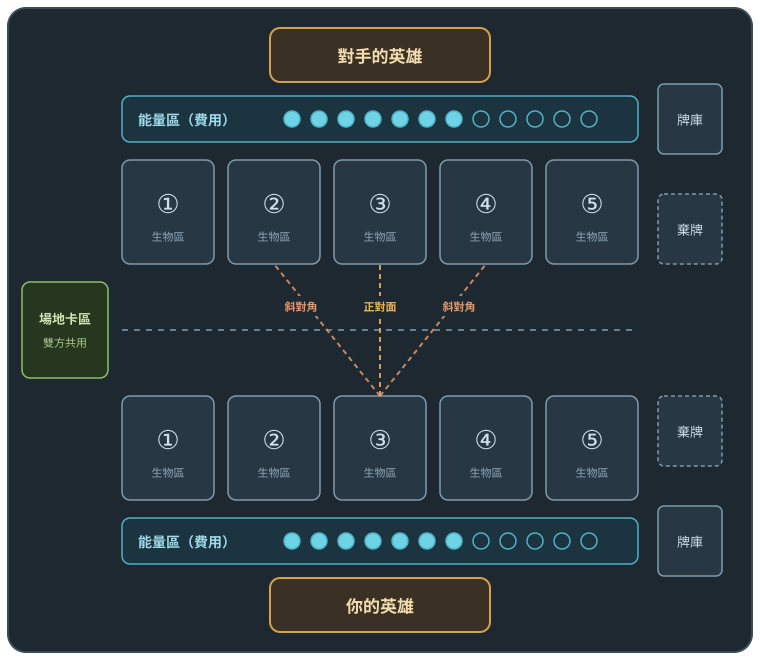

# 卡牌遊戲設計文件

> 狀態：**主線**（`main`）：爐石式的攻擊與數字（原本是大縮模實驗，已經定案）｜規則引擎已實作（全部 331 個測試）｜最後更新：2026-09-27

一款線上對戰卡牌遊戲。骨架來自寶可夢卡牌（進化、血量比例），能量與英雄的做法參考爐石
和海賊王卡牌，顏色系統參考魔法風雲會：每位玩家有自己的能量池，召喚、技能、法術全部從池裡付費；
每位玩家有一名英雄，英雄的顏色決定牌組能放哪些卡，英雄被打倒就輸。

---

## 爐石式的數字（已經定案）

原本是實驗分支，試試看改成跟爐石差不多的模型會不會比較好玩：生物有攻擊力，數字跟爐石一樣（攻擊 = 費用、HP = 費用 + 1）。
一開始縮得比較小（攻擊 ⌈費用 ÷ 2⌉、HP ⌊費用 ÷ 2⌋ + 2），回饋覺得縮太多，改成現在這樣；試玩後定案，成為主線。
**這一節與後面的「已確定的規格」是目前的規則**；再後面的「規則草案」是比較早寫的詳細規則，衝突的地方以這兩節為準。

### 牌組

- **30 張**，同名卡最多 **2 張**，**UR 最多 1 張**（v0.8 是 40 張、同名 3 張）。
- **最多進化一次**。進化線建議照 **2/2** 帶：基礎 2 張、進化 2 張。電腦的牌組與組牌畫面的自動組牌都照這個帶。
  原本的二階進化（熾天使、深海水母皇、死亡騎士、九尾天狐、古樹熊神）改成單獨的基礎生物，技能照留。
  它們的技能是照二階的預算做的，所以**數值照 R（不拿 SR/UR 多的數值）**；技能原本多貴 1 費，太貴一場用不到一次，後來改回一般的費用。
- 9 費以上的卡建議 2 張以內，自動組牌也最多帶 2 張。

### 攻擊與技能

- 每隻生物有**攻擊力**和 **HP**。網頁上 HP 滿的是綠色、受過傷的是紅色。
- 每隻生物每回合可以**攻擊一次**，也可以**發動一個技能一次**，兩個都做也行，順序不限：
  - **攻擊**：不花能量，**只打得到正前方與左右兩個斜對角**（邊邊的格子只有兩格）的生物。那幾格**只要有一格空著，
    就能從空格打到後面的英雄**；全被擋住就打不到英雄。打生物時，**對方同時用牠的攻擊力反擊**；打英雄不會被反擊。
  - 一開始做成「三格全空才打得到英雄」（跟位置技能一樣），模擬出來對局拖到 8–12 分鐘、快攻英雄勝率掉到 30% 多，所以改成現在這樣。
  - **技能**：花能量，**不會被反擊**。
  - 原本是「攻擊或技能選一個」，但技能都要花能量，選技能就等於白白放棄一次免費的攻擊，所以改成各一次。
- **休息技能**：標「休息」的技能**不花能量**，但這回合**還沒攻擊**才能用，用了這回合就不能攻擊。
  給挑釁、增益這類「這回合不打、換別的好處」的效果：縮殼、挑釁、守護、磨刀、年輪、深根、聖盾。
- 召喚當回合不能攻擊、不能發動技能（【速攻】例外）。
- **進化卡都有速攻**：召喚當回合就能進化，進化完馬上能攻擊或發動技能（不然進化要多等一回合，很虧）。
  已經攻擊或用過技能的生物，進化後不會多一次。
- **挑釁**：攻擊範圍裡有挑釁中的生物時，只能攻擊牠；挑釁的生物不在範圍內就不受影響。技能的挑釁規則照舊。
- 攻擊範圍讓格子位置有意義：擋在前面的生物保護英雄，放在邊邊的生物比較難被打到，也比較難打到別人。
- 被攻擊的一方就算麻痺、沉默也會反擊，反擊不算牠的行動；**虛弱的不會反擊**。攻擊力 0 的生物不能攻擊，反擊也是 0。
- **一回合可以進化很多隻生物**，沒有次數限制；同一隻最多進化一次（沒有第二階）。
- **攻擊加成**（增益指示物、道具、場地卡、英雄被動）只加在攻擊與反擊上，**技能傷害就是卡上的數字**。
- 減傷擋得住攻擊與反擊；吸血在攻擊、反擊、技能造成傷害時都會回復英雄。

### 種族

每隻生物有一個種族，大多數有那個種族的特色，**特色有強度**（同袍 1、同袍 2……），寫在卡上。
沉默時種族特色跟卡上其他效果一樣失效；進化線上的卡同一個種族。

| 種族 | 特色 | 預設 | 不一樣的卡 |
|---|---|---|---|
| 人類 | **同袍 N**：我方場上有其他人類時 ⚔ +N | 1 | 2：流浪傭兵、聖騎士、血祭術士；沒有：聖泉修女、虛空學者 |
| 野獸 | **猛撲**：召喚當回合就能攻擊生物（不能打英雄） | 有 | 沒有：岩殼龜、小水母 |
| 亡靈 | **不死 N**：第一次被打倒時留下 N♥（消滅不算打倒） | 1 | 2：骷髏騎士、死亡騎士、腐朽之王 |
| 元素 | **元素之力 N**：技能、進場與遺言的傷害 +N | 1 | 沒有：湧泉精靈 |
| 植物 | **扎根 N**：你的回合開始時回復 N♥ | 1 | 2：古樹之根、藤蔓巨像 |
| 龍 | **龍鱗**：不會中異常狀態（同一張卡的其他效果照樣結算） | 有 | — |
| 機械 | **堅固 N**：受到的傷害 −N | 1 | 2：攻城巨像 |
| 天使 | **光輝 N**：召喚時你的英雄回復 N♥ | 3 | 2：聖光使者；4：光之巨神 |

- 原本每張卡的特色都一樣大，改成寫在卡上的強度：大卡可以強一點，也可以整張拿掉（例如烏龜不會撲人）。
  「其他人類」只看種族，沒有同袍的人類一樣會讓別的人類 +N。
- 構造體改名機械。
- 特色都很小，數值沒有另外扣；照模擬調英雄 HP。
- **亡靈的「不死」會不會太強？**用 8400 局英雄對戰看牌組裡亡靈的張數：0 張 50.2%、1–3 張 50.3%、4–6 張 48.7%、7 張以上 51.1%，
  帶越多沒有越強；每張亡靈卡 49.4%–53.9%（深淵吞噬者最高）。其他種族也一樣，牌組裡某種族的卡多寡對勝率影響不大。
  不過電腦不會刻意利用不死（例如明知會留 1♥ 就先換掉對手的大生物），真人玩起來可能比較強，試玩時留意。
- 之後可以做「種族相關」的卡：例如「我方每有一隻野獸，⚔ +1」、「召喚一隻亡靈時抽 1 張」，讓組牌多一個方向。

### 異常狀態

| 狀態 | 效果 | 持續 | 顏色 |
|---|---|---|---|
| **中毒 N** | **施放者的回合結束**時失去 N HP（不算傷害，減傷擋不住；再中一次數字相加） | 被擊倒或進化 | 黑 |
| **灼燒 N** | **施放者的回合結束**時受到 N 傷害（算傷害，減傷擋得住；再中一次取大的） | 被擊倒或進化 | 紅 |
| **麻痺** | 不能攻擊、不能發動技能 | 到擁有者的下一個回合結束 | 藍 |
| **沉默** | 不能發動技能，**卡上的效果失效**（吸血、再生），**已發動在牠身上的效果消失**（增益指示物、挑釁）；攻擊照常 | 同上 | 白 |
| **虛弱** | 不能攻擊，**也不會反擊**；技能照常 | 同上 | 綠 |

原本有七種，太多了，改成這五種：拿掉繳械（併進虛弱）、詛咒，虛弱從「攻擊減半」改成不能攻擊也不能反擊。

- **觸發時間統一**：中毒、灼燒都在**施放者的回合結束**時發作（先中毒、再灼燒）。異常狀態只能中在對手的生物上，
  所以就是「你的每個回合結束時，你施放的中毒、灼燒發作」，施放的那回合就會先扣一次。
- 中毒與灼燒一樣都是扣血，回復與再生補得回來；差別是中毒不算傷害（減傷擋不住）、再中一次數字相加。
- **沉默**跟爐石一樣：增益指示物與挑釁直接拿掉，沉默結束也不會回來。拿掉 HP 增益不會讓牠死掉——
  目前的 HP 超過新的上限才壓到上限，沒超過就不變。吸血、再生只在沉默期間失效。道具給的數值不受影響，但道具給的技能一樣不能用。
- 進化一樣解除全部異常狀態。
- 原本用到繳械、詛咒的卡：聖光使者的進場與噤聲（原本的繳械法術）改成沉默；咒術巫婆的咒縛改成中毒 1；衰敗詛咒改成中毒 3；
  絞殺藤的纏繞（虛弱）變強了，從 1 費改成 2 費。

### 卡牌

- **技能數照稀有度**：基本卡包 N 0、R／SR 1、UR 2；擴充卡包 1／2／3／4（見[已確定的規格](#已確定的規格)的「稀有度」）。
- **無色卡比有顏色的卡弱一點**：同費用、同稀有度少 1 點數值。
- **看牌庫頂選牌**：潮汐占卜（藍 4 費）翻開牌庫頂 4 張、選 2 張加入手牌，其餘照順序放回牌庫底；
  翻開的牌只有自己看得到，對手只看到你拿了幾張。另外有知識洪流（藍 5 費抽 3）；綠色的豐收儀式從 4 費改成 3 費。
- **衍生物（token）**：只能由效果召喚、不能放進牌組，放在自己最左邊的空格，召喚當回合一樣不能攻擊；
  被擊倒或退場就消失，不進棄牌區。士兵（白 ⚔2 ♥2）：集結號令（4 費召喚 2 隻）、騎士隊長（5 費，進場帶 1 隻，技能再叫 1 隻）、殉道騎士的遺言；
  骷髏（黑 ⚔1 ♥1 亡靈）：屍骨領主的遺言；烈陽騎兵（白紅 ⚔1 ♥1 人類、速攻）：烈陽統帥的天生技。
  說明文字會帶上衍生物的數值，例如「召喚 1 隻烈陽騎兵（1/1、速攻）」。
- **遺言**：生物死掉時發動，見[遺言](#遺言)。
- **持續效果**：生物在場上時，每當條件成立就自動發動，不選目標、不花能量，沉默中不發動。算一個技能的份量（R、SR 有持續效果就沒有技能）。
  時機有三種：**回合開始**（抽牌、再生之後）、**回合結束**（中毒、灼燒之前）、**每當回復**（每當我方英雄回復 ♥）。
  「每當回復」發動的效果如果又回復英雄，不會再觸發一次，免得無限循環。

| 生物 | 顏色 | 費用 | 數值 | 持續效果 |
|---|---|---|---|---|
| 聖光守護者 | 白 R 天使 | 4 | 2/5 | **每當回復** 聖光共鳴：自身 +1/+1（召喚時的光輝也算） |
| 星象學者 | 藍 R 人類 | 4 | 3/4 | **回合結束** 觀星：抽 1 張 |
| 腐化祭司 | 黑 R 人類 | 4 | 3/4 | **回合結束** 腐化：對手每隻生物中毒 1 |
| 烈焰之心 | 紅 SR 元素 | 6 | 5/6 | **回合結束** 餘燼風暴：對手每隻生物 1 傷害（元素之力再 +1） |
| 生命古樹 | 綠 R 植物 | 5 | 2/7 | **回合開始** 生命之泉：我方英雄與每隻生物回復 2 |

- **技能召喚衍生物**：死靈術士（黑 R 4 費 3/4，喚骨（3）召喚 1 隻骷髏）、森林守護者（綠 R 4 費 3/5，播種（2）召喚 1 隻小樹精 1/2 植物）、
  火焰召喚師（紅 R 4 費 3/3，召火（3）召喚 1 隻火靈 2/1 元素**速攻**），加上原本的騎士隊長（白，號召召喚士兵）。
- **種族相關的卡**：讓組牌多一個方向（野獸牌組、亡靈牌組……）。兩種新寫法：
  **同族加成**（我方每有另一隻某種族，牠 ⚔ +N，沉默中失效）與 **每當召喚**（每當你召喚某種族的生物就發動，衍生物也算、不含牠自己）。
  同族加成、持續效果都算一個技能的份量。

| 生物 | 顏色 | 費用 | 數值 | 效果 |
|---|---|---|---|---|
| 狼群首領 | 綠 R 野獸 | 4 | 3/4 | 我方每有另一隻野獸，牠 ⚔ +1 |
| 潮汐喚獸師 | 藍 R 人類 | 3 | 2/3 | **每當召喚**野獸：抽 1 張 |
| 守墓人 | 黑 R 人類 | 3 | 2/4 | **每當召喚**亡靈：抽 1 張（死靈術士、屍骨領主的骷髏也算） |
| 軍團旗手 | 白 R 人類 | 3 | 2/3 | **每當召喚**人類：自身 +1/+1（士兵、烈陽騎兵也算） |
| 元素領主 | 紅 SR 元素 | 5 | 4/5 | 我方每有另一隻元素，牠 ⚔ +1 |
| 花之精靈 | 綠 R 植物 | 2 | 1/3 | **每當召喚**植物：我方英雄回復 3 |

- **卡面文字用關鍵字**：常見的效果寫成粗體的關鍵字（**中毒 2**、**遺言**、**速攻**、**同袍 2**），點卡片看說明時，
  下面用小字列出用到的關鍵字是什麼意思。卡面短，新手也查得到。
- **能量上限 −X（自己付）**：另一種費用，發動時自己的能量上限 −X，不用花能量。能量上限不到 X 就不能發動；
  這回合的能量超過新的上限就壓到上限。能量上限之後照常每回合 +2、最高 12，所以前期代價大、後期接近免費——
  效果給得比同樣能量的強一點（例如 −2 對任意目標打 4，一般要 3 能量）。卡面寫成「燃命（能量上限 −2）」。

| 生物 | 顏色 | 費用 | 技能 |
|---|---|---|---|
| 湧泉精靈 | 藍 R | 2 | 湧泉（能量上限 −2）：抽 2 張 |
| 焚身狂徒 | 紅 R | 3 | 燃命（能量上限 −2）：任意目標 4 傷害 |
| 血祭術士 | 黑 R | 4 | 血祭（能量上限 −3）：只打生物 6 傷害 |
| 過載石像 | 無色 R | 5 | 過載（能量上限 −2）：自身 +3/+3 |
| 虛空學者 | 藍 SR | 6 | 虛空奔流（能量上限 −4）：對手每隻生物 2 傷害 |
| 深淵吞噬者 | 黑 UR | 8 | 深淵獻祭（能量上限 −5）：任意目標 7 傷害；深淵之觸（5）：只打生物 7 傷害 |

- **道具可以給技能**：裝上的生物多一個技能，排在自己的技能後面，一樣跟攻擊合計每回合一次。
  範例：長弓（無色，射擊 1 費打 1）、聖徽（白，祈禱 1 費回復 3）、冰霜法杖（藍，冰凍 2 費麻痺）。
- **每個顏色有自己的場地卡**，效果只作用在自己身上：

| 場地 | 顏色 | 費用 | 效果 |
|---|---|---|---|
| 聖域 | 白 | 3 | 你的回合開始時，英雄回復 3 |
| 知識之泉 | 藍 | 2 | 你的回合開始時多抽 1 張 |
| 腐沼 | 黑 | 5 | 你的回合開始時，對手每隻生物失去 1 HP；吸血：失去多少，你的英雄就回復多少 |
| 燎原戰鼓 | 紅 | 3 | 我方每隻生物攻擊 +1（不加技能傷害） |
| 守護聖壇 | 綠 | 4 | 我方每隻生物 HP 上限 +2（原本是無色 3 費 +2） |

### 英雄

**基礎五色**：每個人都有，一個顏色一個。

| 英雄 | 顏色 | HP | 效果 |
|---|---|---|---|
| 無名劍士 | 白 | 44 | 劍士之道：我方生物 ⚔ +1 |
| 深海先知 | 藍 | 45 | 天生技 預見（能量 3）：抽 1 張 |
| 冥府祭司 | 黑 | 41 | 天生技 蝕心（能量 4）：對手隨機棄 1 張 |
| 烈焰領主 | 紅 | 45 | 天生技 燃燼（能量 2）：任意目標 2 傷害 |
| 林海之王 | 綠 | 45 | 林海之息：我方生物 **再生 1**；萌發（能量 2）：能量上限 +1，我方英雄與每隻生物回復 2 |

- **無名劍士**的被動原本是「我方生物 ⚔ +1；我方回合再 ⚔ +1；**突破**（被擋住也打得到英雄）」。在有第二、三彈的環境裡他到 63%；
  對照實驗顯示「我方回合 +1」與「突破」各貢獻約 5%–7%，兩個都拿掉，只留 ⚔ +1（引擎還支援突破，目前沒有英雄用）。
  只有第一彈時他因此掉到約 42%，所以第一彈補了白色的強力單卡（見下）。調完第一彈 50%，全系列約 57%（發布第二彈前再看）。
- **藍色的勝利手段**：深海先知抽了很多牌之後，要有把手牌變成傷害的方法。第一彈補了 6 張藍卡：
  **手牌傷害**（造成等同你手牌張數的傷害）的知識之刃、秘典守衛、記憶巨鯨；**回到手牌**（把對手的生物連同進化堆疊彈回他的手牌，
  道具進棄牌區，衍生物消失，手牌滿了的進棄牌區）的潮汐反彈、天潮倒灌；以及藍色的大牌萬知海皇（進場抽 2、手牌傷害、彈回手牌）。
  手牌傷害照「約 1 能量 1 傷害」估：藍色中盤手牌約 4–5 張，所以**可以重複用的手牌傷害技能要 4–5 能量**
  （一開始用 2–3 能量，深海先知衝到 62%；調貴之後回到 52%）。
- **白色的強力單卡**：第一彈的白卡整體偏弱（模擬 41%–45%），無名劍士的被動變簡單之後他只剩約 42%。
  補 4 張鋪場與全體增益的卡，每隻生物都吃得到無名劍士的 ⚔ +1，翠林聖女也用得到：
  聖劍騎士（R 4 費 3/4，進場召喚士兵；鼓舞：增益 1）、王國元帥（SR 6 費 4/5，進場召喚 2 隻士兵；王令（4）：我方每隻生物 ⚔ +1）、
  勝利號角（SR 法術 4 費，我方每隻生物增益 1、抽 1）、天界聖王（UR 8 費 8/9，進場我方每隻生物增益 1；聖劍審判、聖王之令）。
  第一版（4/4、5/6、3 費、增益 2）讓白色英雄衝到 56%–61%，調過之後 4 張都在 51%–55%。
- 補了藍、白的卡之後一起調的英雄：**冥府祭司** HP 37 → 41、蝕心 5 → 4 費（有第二、三彈時 37 只有 43%，41 是 49%；
  42 在只有第一彈時太強）；**林海之王**萌發 3 → 2 費（被白色壓到 43%–45%，再生 2 沒有用）；**翠林聖女** HP 39 → 36
  （豐饒 ♥ +2 跟士兵鋪場特別合；改成 ♥ +1 會掉到 40%，所以只降 HP；她還在 52%–58% 之間，之後看真人數據再調）；
  **烈焰領主** HP 43 → 45（紅卡整體偏弱，他剩 44%）。

**UR 英雄**：雙色以上的英雄是 UR，要從卡包抽到（每包的 UR 可能開到英雄），或用 1000 粉塵合成；已經有了再開到換成 300 粉塵。
技能盡量不跟別的英雄重複：

| 英雄 | 顏色 | HP | 效果 |
|---|---|---|---|
| 翠林聖女 | 白綠 | 36 | 豐饒：我方生物 ♥ 上限 +2 |
| 潮影雙生 | 藍黑 | 38 | 天生技輪流：潮之面（能量 4）抽 1 張，用完變成影之面（能量 4）對手隨機棄 1 張，再變回來 |
| 烈陽統帥 | 白紅 | 38 | 天生技 衝鋒號（能量 2）：召喚 1 隻烈陽騎兵（1/1、人類、速攻，召喚當回合就能攻擊） |
| 虹彩賢者 | 五色 | 40 | 天生技 稜光（能量 3）：我方每隻生物 +1/+1 |

- 天生技都**沒有次數限制**。引擎還支援每局次數（`uses`），目前沒有英雄用。
- 英雄進化（都是 **UR**，所以牌組只能放 1 張；6 費左右、HP +9～11）：

| 英雄進化 | 由誰進化 | 費用 | HP | 進場 | 天生技換成 |
|---|---|---|---|---|---|
| 無名劍聖 | 無名劍士 | 6 | +9 | 我方生物 +2/+2 | 劍意（2）：我方生物 +3/+3 |
| 深淵大賢者 | 深海先知 | 5 | +10 | 抽 2 張 | 洞見（2）：抽 1 張 |
| 冥府之主 | 冥府祭司 | 6 | +10 | 對手每隻生物中毒 2 | 奪心（4）：對手隨機棄 1 張 |
| 烈焰君王 | 烈焰領主 | 6 | +9 | 對手每隻生物 2 傷害 | 煉獄（2）：任意目標 3 傷害 |
| 萬木之王 | 林海之王 | 5 | +11 | 能量上限 +1 | 萬木生長（3）：抽 1 張、我方英雄與每隻生物回復 3 |
| 潮影君主 | 潮影雙生 | 6 | +11 | 對手隨機棄 2 張 | 深淵低語（5）：對手隨機棄 1 張、抽 1 張 |
| 翠林女神 | 翠林聖女 | 6 | +10 | 召喚 2 隻小樹精 | 多一個天生技 花語（3）：我方每隻生物 ♥ 上限 +2、我方英雄回復 2 |
| 烈陽大元帥 | 烈陽統帥 | 6 | +10 | 召喚 1 隻烈陽騎兵 | 全軍突擊（4）：召喚 1 隻烈陽騎兵、我方每隻生物 ⚔ +1 |
| 虹光大賢者 | 虹彩賢者 | 6 | +8 | 我方每隻生物增益 1 | 虹光（4）：我方每隻生物增益 1、抽 1 張 |

  每個英雄都有英雄進化卡了。翠林聖女原本只有被動，進化後多一個天生技。
- 規則引擎也支援「只在我方回合」或「只在對方回合」生效的被動，目前的英雄沒有用到。

**英雄 HP 在 35–45 之間**：HP 低一點快攻才打得死。英雄的 HP 沒有上限，回復可以補到比起始 HP 還高。
HP 與技能用**困難電腦**的英雄對戰模擬調（它會模擬對手的回應，比普通電腦準），
目標是**每個英雄對其他英雄的平均勝率都在 45%–55%**，結果見[模擬結果](#模擬結果)。
HP 從 36–66 降到 35–45 時，只調 HP 調不平，所以也改了技能：

- **無名劍士**：HP 已經到 45，改成在自己的回合攻擊再 +1（44% → 51%）。（後來有第二、三彈時太強，又拿掉，見上面。）
- **烈焰領主**：燃燼 1 費 1 傷害偏弱（43%）；2 費 3 傷害、3 費 4 傷害都太強（55%、59%，一發能解的生物變多），定在 2 費 2 傷害（48%）。
- **林海之王**：萌發多了全體回復 2，HP 45。萌發試過 2 費（52%），但那樣比能量結晶（2 費上限 +1）、森林之息（2 費全體回復 3）
  都划算，林海之王的牌組就不會帶這兩張，所以留在 3 費（後來第一彈補了白、藍的卡，還是改成 2 費，見上面）。偏弱的部分改用被動「林海之息」（我方生物 **再生 1**）補，不動萌發。
  進化後的萬木生長改成抽 1 張、全體回復 3（接近能量上限 12 時，加上限沒有用）。
- **翠林聖女**：豐饒 ♥ +1 → +2（HP 低了之後生物要更耐打）。
- **抽牌、棄牌調貴**：潮影雙生的潮之面 3 → 4 費，冥府祭司的蝕心 4 → 5 費（後來又改回 4 費：模擬裡 4、5 費勝率幾乎一樣）；進化後的奪心 3 → 4、深淵低語 3 → 5。
  HP 變低、對局變短之後，累積手牌優勢的英雄反而更強（困難電腦下潮影雙生原本 62%）。

### 單卡強度

每張卡的勝率（所有英雄對戰裡，帶了這張卡的牌組贏的比例）也要在 **45%–55%**，用困難電腦量
（`BOT=hard npx tsx packages/sim/card-all.ts 100`，九個英雄兩兩對戰每組 100 局，共 3600 局；`CARD_PREVIEW=1` 連還沒發布的卡一起量）。

- 最近一次（範圍傷害改成費用 −1 之後）：**145 張裡 139 張在範圍內**，超出的六張都在 55.0%–56.6%，離邊界不到一個誤差，先不動。
- 局數少的卡（例如只有 72 局的遠古巨龍、367 局的大地泰坦）誤差很大，一輪一輪跳動，看趨勢就好。
- 普通電腦量出來白卡普遍偏高、藍黑卡偏低，那是普通電腦偏好直接打臉，不是卡的問題；所以卡牌強度以困難電腦為準。
- 綠色的大生物特別容易偏強：林海之王的「萌發」能提早把牠們放出來，山嶺巨人、大地泰坦又是元素，範圍傷害多 1。

### 模擬結果

英雄兩兩對戰用困難電腦（它一步要想約 30 毫秒，比普通電腦慢 20 多倍，所以每組 100 局；一個英雄對其他英雄共 800 局，誤差大約 ±2 個百分點）。

1. **九個英雄對其他英雄都在 47.4%–54.6%**（最近一次，範圍傷害改成費用 −1 之後）。
2. **先後攻**：拿掉後攻多的 1 點能量之後，英雄鏡像的先攻勝率平均約 49%。
3. **對局長度**：快攻（無名劍士）中位數約 5 分鐘，控場（深海先知）約 9 分鐘，大多落在 5–10 分鐘。
   先後手、英雄血量與對局時間的完整數據見 [balance-results.md](balance-results.md)（普通電腦、局數多）。

---

v0.7、v0.8 以前的規則與變更紀錄見 git 歷史。

---

## 已確定的規格

這一節是目前的規格（爐石式的攻擊與數字）。v0.8 以前的規格見 git 歷史與 PR 分支。

**定位**
- 線上對戰遊戲，**TypeScript**
- 骨架來自寶可夢卡牌（進化、能量），生物的打法跟數字像爐石：**攻擊力 + HP**，每回合可以免費攻擊
- 生物的基準：**攻擊 = 費用，HP = 費用 + 1**（進化生物用總費用算）；英雄 **35–45 HP**
- **一局大約 5–10 分鐘**
- 生物的模型不要太爆：**一張同費用的法術要能解掉一隻同費用的生物**，不然大家只帶生物就好

**場上**
- 每位玩家有 **5 個生物區**、**1 個英雄區**、**1 個自己的場地區**
- 生物召喚後**不能移動**，除非卡牌效果；沒有撤退
- 自己的回合可以讓自己的生物**退場**：連同道具送進棄牌區，空出格子給新的生物，不花能量

**開局與牌組**
- 牌組 **30 張**，同名卡最多 **2 張**，**UR 最多 1 張**
- **開局前選好英雄**，雙方先看到對手的英雄，再決定起手
- 進化線建議照 **2/2** 帶（基礎 2、進化 2），手牌才不會卡一堆用不了的進化卡
- 各抽 **4 張**，可以把任意張洗回牌庫重抽，限一次

**能量**（已經定案）
- 每位玩家有自己的**能量池**，能量不貼在生物身上
- **先攻第一回合能量上限 1、後攻 2，之後雙方每回合 +2**
- **後攻沒有其他補償**，只有第一回合的上限多 1（2 比 1）。試過後攻第一回合再多補 1 點能量、後攻起手多 1 張，都補過頭，拿掉了；
  用困難電腦模擬，英雄鏡像的先攻勝率平均約 49%。
- 自己的回合開始時，能量**重置**為新的上限；沒花完的能量不保留
- **最高上限 12**，突破型先不出
- 召喚、進化、技能、法術、道具、場地卡都要花能量；**攻擊不用**
- 能量**沒有顏色**，任何費用都用同一種能量付；顏色只限制牌組
- 能量區是**一整排能量池**，不像遊戲王的魔法陷阱區分成 5 格

**稀有度**
- **N／R／SR／UR** 四種
- 生物的技能數照稀有度，分成兩套：
  - **基本卡包刻意維持簡單**，讓新玩家好熟悉：**N 沒有技能**（只有數值），**R、SR 一個**，**UR 兩個**。
    持續效果、同族加成算一個技能；進場效果與遺言不算。
  - **擴充卡包**（從第二彈「龍脈覺醒」開始）：**N／R／SR／UR 各 1／2／3／4 個能力**。**一個詞條就算一個**：
    種族特色（龍鱗、同袍 1……）、關鍵字（速攻、吸血、再生）、進場、遺言、持續效果、同族加成、技能都各算一個；
    每多一個，身材比基準少約 1 點。
- 進化時稀有度往上升：**N → R**；較強的進化鏈是 **R → SR**；**最多進化一次**
- 強度預算：**N、R 照基準（R 多的是技能），SR 多約 10%、UR 多約 20%**
- **有顏色的卡比無色卡強一點**：同費用、同稀有度，無色少 1 點數值

**顏色與英雄**
- **五個顏色**，像魔法風雲會
- 英雄的顏色**限制牌組**能放的卡
- **基礎五色的英雄**每個人都有；**雙色以上的英雄是 UR**，要從卡包抽到或用粉塵合成
- 英雄 **HP 35–45**：效果越強 HP 越低，最後照困難電腦的英雄對戰模擬調整。顏色數不再直接決定 HP（雙色以上的 UR 英雄大多 38–40）
- 英雄有很多種：有些有主動的**天生技**（像爐石），有些有**被動效果**（像海賊王卡的領袖）
- 英雄不會攻擊，也不會反擊；不會發動生物技能，也不能掛道具
- **英雄進化卡**放在牌組裡，進化後 HP 增加、天生技變強；**每局限進化一次**，沒有第二階，費用約 **5–7**
- 天生技目前都沒有次數限制（引擎支援每局次數，進化換成新的天生技時重新算）
- **要抽牌但牌庫已經空了就落敗**：回合開始的抽牌、卡牌效果的抽牌都一樣（抽到剛好空掉不會輸，下一次要抽才會）
- 沒有屬性弱點

**生物：攻擊與技能**
- 每隻生物每回合**攻擊一次、發動技能一次**，兩個都可以做：
  - **攻擊**：不花能量，只打得到**正前方與兩個斜對角**的生物，那幾格有一格空著就打得到英雄；打生物時對方**同時反擊**，打英雄不會被反擊
  - **技能**：花能量，**不會被反擊**
  - **休息技能**：不花能量，這回合還沒攻擊才能用，用了就不能攻擊
- **召喚當回合不能攻擊、不能發動技能**，除非有【速攻】；**進化卡都有速攻**（召喚當回合就能進化，進化完馬上能動）
- 回合要**宣告結束**才會結束；**對手的回合不能互動**
- **挑釁**：攻擊範圍裡有挑釁中的生物時，只能攻擊牠；技能能選到牠的也必須選牠（只打英雄的技能不受影響）
- **攻擊加成**（增益、道具、場地卡、英雄被動）只加在攻擊與反擊上；**技能傷害就是卡上的數字**
- 技能的目標類型：任意單位；只打生物或只打英雄；斜對角或正對面（**位置技能**，目標格空著就打到英雄）；
  以及功能性效果（挑釁、抽牌、HP 減半、範圍傷害、增益等）。目標限制越多傷害越高
- **增益指示物**：加攻擊與 HP 上限，進化後保留
- **HP 減半**算失去 HP，不算傷害；**消滅**不看 HP，直接送進棄牌區
- **進場效果**：生物進場時發動，例如一進場就造成傷害或抽牌
- 生物的**費用寫在左上角**；進化過的寫成「4+3」，一眼看出對手在牠身上投資了多少
- **進化**：場上要有對應的生物並支付費用，進化後數值與技能變強，**已受的傷害保留**。
  也可以有技能**從牌庫拿自己的進化卡**，或**直接進化**
- **手牌上限 10**
- **吸血**：造成傷害時（攻擊、反擊、技能）英雄回復等量的 HP；**再生**：回合開始時回復

**異常狀態**（只作用在生物身上，**進化會解除全部**）
- **五種**：
  - **中毒**（失去 HP）、**灼燒**（受到傷害）：都在**施放者的回合結束**時發作，一直扣到被擊倒或進化
  - **麻痺**（不能攻擊也不能發動技能）、**沉默**（不能發動技能，吸血、再生失效，身上的增益與挑釁消失）、
    **虛弱**（不能攻擊，也不會反擊）：都到擁有者的下一個回合結束
- 顏色：白是沉默，藍是麻痺，黑是中毒，紅是灼燒，綠是虛弱

**其他卡牌**
- **法術卡**：要能解掉同費用的生物；也有範圍傷害法術與直接消滅的法術
- **道具卡**：放到生物身上強化牠，**也可以讓牠多一個技能**
- **場地卡**：放在自己的場地區，只強化自己；**每個顏色有自己的場地卡**
- **衍生物**：由效果召喚的生物，不能放進牌組，離場就消失（士兵、骷髏、小樹精、烈陽騎兵；第二彈還有幼龍、雛龍）

**金幣與卡包**（細節見[經濟系統](#經濟系統)）
- **贏一場 10 金幣，每天最多 100**；每天一個**每日任務**，完成 **50 金幣**
- **一包 100 金幣、5 張**，每張 R 20%、SR 5%、UR 1%，其餘 N；**每包至少一張 R 以上**
- 已經有 2 張（UR 1 張）的卡再開到，換成**粉塵**（N 10、R 30、SR 100、UR 300）；**粉塵合成任意一張卡**（N 30、R 100、SR 300、UR 1000）
- 美術用 AI 畫（[art.md](art.md)）

---

## 經濟系統

規則寫在 `packages/economy`，全部是純函式（輸入舊的玩家資料、輸出新的），有測試；網頁與伺服器共用。

**登入**：一進網頁先登入，兩種帳號：

| | 測試帳號 | Google 帳號 |
|---|---|---|
| 一開始 | 10000 金幣、全部的卡都收滿、UR 英雄都有 | 100 金幣、五個基礎英雄的起始牌組 |
| 資料存在 | 這個瀏覽器（可以一鍵重設） | 遊戲伺服器（`data/accounts.json`），換電腦也在 |
| 開卡包的亂數 | 瀏覽器 | 伺服器 |
| 能用的地方 | 哪裡都能用，claude.ai 上的試玩版也行 | 要從遊戲伺服器打開，而且伺服器設定了 `GOOGLE_CLIENT_ID` |

- **名字＋密碼帳號**：不用 Google，名字（不能重複）加密碼就能開，登出或換電腦都能登回來。密碼用 scrypt 加鹽雜湊存，不存明文。
  一開始做成「訪客帳號」（只靠瀏覽器記得登入），登出就再也回不去；改成名字＋密碼時，舊的訪客帳號第一次用原本的名字登入就設定密碼，
  同名的舊帳號全部合併成一個（抽到的卡加在一起，不超過上限；粉塵與金幣相加）。
- Google 登入：網頁用 Google Identity Services 拿到 ID token，交給伺服器；伺服器自己用 Google 的公鑰檢查簽章、
  發給誰（aud）、誰發的（iss）與有效期限，通過才開帳號或登入，發一個 30 天的 session token。檔案裡只存 token 的雜湊。
- **牌組清單**：同一個英雄可以存很多副牌組（每個帳號最多 40 副），各有名字；開局畫面點一副選來用，或選「自動組牌」
  （每局用收藏自動組一副）。每副旁邊寫張數與狀態：可以用、還差幾張、缺幾張卡、不合法；不能用的選了也開不了局。
- **牌組代碼**：組牌畫面按「複製牌組代碼」，得到一串 `CG1-` 開頭的文字（英雄與每張卡的 id、張數）。朋友在開局畫面按「貼上代碼」
  就多一副一樣的牌組；收藏缺的卡照樣放進去，但補齊（開卡包或用粉塵合成）之前不能拿來開局。用卡的 id 而不是編號，之後加新卡舊代碼照樣能用。
- **牌組存在伺服器上**（名字＋密碼與 Google 帳號），換裝置也在；組牌時停下來 0.8 秒才送出，不會每點一下就送。
  以前「每個英雄一副」的舊牌組，讀進來時轉成一副「○○的牌組」並設成那個英雄開局用的；存在瀏覽器裡的，第一次登入時搬上伺服器。
  測試帳號的牌組照舊存在瀏覽器。
- **還防不了作弊的地方**：跟電腦打的勝負與任務數字是瀏覽器回報的（電腦對手跑在瀏覽器裡），伺服器只檢查格式、把數字壓在合理範圍。
  贏場金幣每天有上限，影響有限；要完全防，得把電腦對戰也搬到伺服器上跑。

**新玩家**：收藏是五個基礎英雄各一副起始牌組用到的卡（同一張取最多的那副），所以每個基礎英雄一開始就組得出合法的牌組；
UR 英雄要從卡包抽；
另外送 100 金幣，可以先開一包。組牌與自動組牌只能用收藏裡的卡，電腦對手不受限制。

**金幣**
- 贏一場 10 金幣，每天從贏場最多拿 100（10 場）；任務獎勵另外算
- 自己投降的對局沒有金幣、也不算任務進度（不然開局就投降可以刷「遊玩 3 場」）
- 跟電腦打與連線對戰都算

**每日任務**：每天一個，照日期決定，同一天大家拿到同一個；換日就換新的、進度歸零。完成 50 金幣。

| 任務 | 目標 |
|---|---|
| 遊玩 | 3 場 |
| 獲勝 | 2 場 |
| 用有某個顏色的卡的牌組獲勝（五色各一個） | 1 場 |
| 召喚生物（含衍生物） | 10 隻 |
| 抽牌（起手與換牌不算） | 15 張 |
| 施放法術 | 6 張 |

**卡包**
- 100 金幣一包，5 張。每張獨立抽稀有度：UR 1%、SR 5%、R 20%、N 74%，再從那個稀有度的卡裡平均抽一張
- **保底**：5 張都是 N 的話（約 22%），最後一張改成 R 以上，照 R : SR : UR = 20 : 5 : 1 的比例
- 衍生物開不到；英雄進化卡開得到；**UR 那一格也可能開到 UR 英雄**（UR 卡與 UR 英雄平均抽），英雄最多擁有 1 個
- 已經有滿（2 張，UR 1 張）的卡再開到，換成粉塵：N 10、R 30、SR 100、UR 300
- **一次開 10 包**（1000 金幣）：一包一包照同樣的規則抽，50 張照稀有度排好，上面寫一行總結（各稀有度幾張、新卡幾張、粉塵 +多少）

**粉塵合成**：粉塵合成任意一張沒收齊的卡（或還沒有的 UR 英雄）：N 30、R 100、SR 300、UR 1000。
多餘的卡換回的粉塵大約是合成價的 1/3。

- 原本是**兌換卷**（多餘的卡換一張同稀有度的兌換卷，3 張換一張同稀有度的卡），問題是 N 種類少、很快就收滿，
  之後開到的 N 都變成用不到的 N 兌換卷。改成粉塵之後各稀有度通用，多餘的 N 也能存起來合成 SR、UR。
  換回的比例跟兌換卷差不多（約 1/3），收集速度不會暴衝。
- 舊存檔的兌換卷讀進來時自動換成粉塵：N 10、R 30、SR 100、UR 300 一張。

**收集要多久**（現在 149 種、收滿 279 張；模擬 200 個新玩家，粉塵一夠就合成缺的卡，先合貴的）

| | 起始 | 80% | 90% | 收滿 |
|---|---|---|---|---|
| 要開的包數（中位數） | 0（132 張） | 52 包 | 78 包 | 185 包 |
| 每天拿滿 150 金幣要幾天 | — | 約 35 天 | 約 52 天 | 約 123 天 |

- 兌換卷時代卡比較少（231 張）卻要 251 包才收滿，因為最後幾個 UR 只能靠 UR 兌換卷；粉塵讓多餘的 N、R 也能換 UR，收滿快了不少。
- 起始收藏是五個基礎英雄各一副起始牌組，涵蓋了每個顏色。想讓卡包更有吸引力，可以改成只送一副起始牌組、其他英雄用任務解鎖

**美術**：用 AI 畫，風格與提示詞見 [art.md](art.md)。每張卡（含英雄）都有一張插圖，放在 `packages/web/public/art/<id>.webp`。

---

## 規則草案

比較早寫的詳細規則，補充上面兩節沒寫到的細節；跟上面衝突的地方，以上面為準。

### 1. 場上區域

配置參考遊戲王，把魔法陷阱區換成能量區。每位玩家由中線往外依序是：

1. **生物區** × 5：靠近中線，跟對手的生物區面對面
2. **能量區（費用）**：一整排能量池，最多 12 點，不分格子
3. **英雄區**：在最後面

- 雙方的生物區**按欄位對齊**。你的 ③ 正對面是對手的 ③，斜對角是對手的 ② 和 ④；
  邊角的 ① 斜對角只有 ②，⑤ 只有 ④。
- 英雄在生物區後面，所以位置技能的目標格空著時，傷害會一路打到英雄——
  空著的格子等於英雄的破口。
- 召喚時**自己選放哪一格**；之後不能移動，除非卡牌效果。
- 五格都滿了就不能再召喚。自己的回合可以讓自己的生物**退場**，連同身上的道具送進棄牌區，空出格子；
  不花能量，也不算擊倒。
- **場地區**每人一個，在自己生物區的左邊，最多放 1 張場地卡。
- **牌庫**與**棄牌區**在自己的右邊。
- 對手那一側整個轉了 180°，所以從你這邊看，**對手的牌庫與棄牌在左邊、場地區在右邊**，跟遊戲王一樣。
  生物區的編號以欄位計，正對面永遠是同一個號碼。
- 能量區是一整排能量池，不分格子。

### 2. 顏色與牌組

五個顏色參考魔法風雲會，每個顏色有擅長的技能類型——設計新卡時照這張表分配，
顏色才有各自的個性：

| 顏色 | 風格 | 擅長 |
|---|---|---|
| **白** | 守護、秩序 | 挑釁、回復、減傷道具 |
| **藍** | 知識、控制 | 抽牌、干擾對手 |
| **黑** | 侵蝕、犧牲 | 破壞卡牌、讓對手棄牌、HP 減半 |
| **紅** | 速度、爆發 | 直接傷害、只打英雄、範圍傷害、速攻 |
| **綠** | 成長、巨大 | 大型生物、提高能量上限、高 HP、吸血與再生 |

- 每張卡有 1 個或多個顏色，或者是**無色**。
- **牌組只能放英雄顏色內的卡，加上無色卡。** 多色卡要英雄包含它的每一個顏色才能放。
- 顏色取代 v0.1 的火水木雷暗屬性，**沒有屬性弱點**。
  數值縮小到個位數以後，弱點 ×2 的波動太大；顏色的個性改由擅長的技能來表現。

### 3. 稀有度

| 稀有度 | 定位 | 強度預算 | 生物的技能數（基本卡包） | 生物的技能數（擴充卡包） |
|---|---|---|---|---|
| **N** | 單純的數值 | 照基準 | 0 | 1 |
| **R** | 開始有特殊機制 | 照基準，多的是技能 | 1 | 2 |
| **SR** | 較強的機制 | 多約 10%（HP 多約 2） | 1 | 3 |
| **UR** | 最強、效果獨特 | 多約 20%（多約 3 點數值） | 2 | 4 |

- 基本卡包：持續效果、同族加成算一個技能，進場效果與遺言不算；基本卡包刻意維持簡單。
- 擴充卡包：一個詞條算一個——種族特色、關鍵字（速攻、吸血、再生）、進場、遺言、持續效果、同族加成、技能都算，每多一個身材少約 1 點。

- 法術、道具、場地卡也有稀有度。
- **進化時稀有度升一級**，**最多進化一次**：
  - 一般的進化鏈：**N → R**
  - 較強的進化鏈：**R → SR**，也可以 SR → UR
- UR 可以是進化鏈的終點，也可以是單獨的基礎生物（例如遠古巨龍、古樹熊神）。

### 4. 牌組與開局

- 牌組 **30 張**，同名卡最多 **2 張**，**UR 最多 1 張**。英雄不在牌組內。
- 進化線建議照 **2/2** 帶：基礎 2 張、進化 2 張。
  進化卡不會比基礎多，手牌才不會卡一堆沒有對應生物的進化卡。這是組牌建議，不是規則。

1. **雙方選好英雄**，擲硬幣決定先後。
2. 洗牌，各抽 **4 張**。這時雙方都看得到對手是哪個英雄。
3. 看過對手的英雄後，可以把任意張手牌洗回牌庫重抽，**限一次**。
4. 先攻玩家開始第 1 回合。後攻第一回合的能量上限是 2（先攻是 1）。

### 5. 能量系統

| 名詞 | 意思 |
|---|---|
| **能量** | 這回合還能花的量 |
| **能量上限** | 每回合補滿到多少 |
| **最高上限** | 能量上限最多能長到多少，預設 **12** |

- **先攻玩家第一回合的能量上限是 1，後攻玩家是 2；之後雙方每個回合 +2**，不超過最高上限。
- 自己的回合開始時，能量**重置**為新的上限（不是累加）。
- 沒花完的能量不保留，下一個回合開始時重置。
- 能量沒有顏色，任何費用都用同一種能量付。顏色只限制牌組，不限制付費。

照回合順序排下來，能量上限是 1、2、3、4、5……每個回合都比前一個回合多 1，不管是誰的回合。
所以**每位玩家手上的能量，永遠比對手上一個回合多 1**，先後手在這個意義上是對稱的。

| 回合 | 1 | 2 | 3 | 4 | 5 | 6 | 7 | 8 | 9 | 10 | 11 | 12 | 13 |
|---|---|---|---|---|---|---|---|---|---|---|---|---|---|
| 誰 | 先 | 後 | 先 | 後 | 先 | 後 | 先 | 後 | 先 | 後 | 先 | 後 | 先 |
| 能量上限 | 1 | 2 | 3 | 4 | 5 | 6 | 7 | 8 | 9 | 10 | 11 | 12 | 12 |

之前擔心兩件事：後攻每一輪都多 1 會不會補償過頭，以及能量變快後英雄的 HP 夠不夠。
[平衡模擬](#平衡模擬)的結果：**兩個擔心都不成立**。

能量花在：召喚生物、進化、生物技能、英雄天生技、法術、道具、場地卡——全部搶同一份預算。

提高上限的卡有兩種：

- **加速型**「能量上限 +1」：比對手早用到高費卡。增加的是上限，當回合不會多一點能量可用。
- **突破型**「最高上限 +2」：讓上限超過 12。**先不出**，最高上限維持 12；規則引擎保留這個能力，之後要用再開。

規則已經定案用上面這套。舊制（從 1 開始每回合 +1、最高 10、後攻補 1 點）只留在 `LEGACY_ENERGY_RULES` 給測試用。

### 6. 回合流程

**回合開始**

1. **抽牌**：抽 1 張。手牌已經 10 張的話，抽到的牌直接進棄牌區。牌庫是空的就落敗。
2. **重置**
   - 能量上限 +2（第一個回合：先攻 1、後攻 2），最高 12；能量重置為新的上限
   - 你的生物本回合的技能次數、英雄的天生技次數重置
   - 你的生物在上一回合發動的挑釁，到這裡結束
3. **再生**：你有再生的生物回復

**行動**：以下動作順序與次數不限，只受能量和各自的限制

- 召喚生物到空的生物區
- 進化場上的生物（一回合可以進化很多隻；進化卡有速攻，召喚當回合就能進化）
- 生物發動技能（每隻每回合 1 個；召喚當回合不能，除非有【速攻】）
- 英雄發動天生技（每回合 1 次）
- 施放法術
- 把道具卡放到自己的生物上（每隻 1 張）
- 把場地卡放到自己的場地區（每回合 1 張；放新的會把自己舊的送進棄牌區）
- 讓自己的生物退場：不花能量，連同進化前的牌和道具送進棄牌區，空出格子

**宣告回合結束**

- 你施放的中毒、灼燒發作（對手的生物先失去中毒的 HP，再受到灼燒的傷害），然後換對手的回合。沒花完的能量不保留。

發動技能不會結束回合，所以順序本身就是策略：先用抽牌技能看抽到什麼，再決定剩下的能量要拿來召喚還是打傷害。

### 7. 生物與技能

- 每隻生物每回合可以**攻擊一次、發動一個技能一次**（見[攻擊與技能](#攻擊與技能)）；技能各有自己的能量費用，技能數照稀有度。
- **召喚當回合不能攻擊、不能發動技能**，除非有【速攻】。否則高費回合可以召喚完立刻發動，爆發太難防。

#### 技能的目標類型

目標限制越多，同樣費用的傷害越高：

| 類型 | 可以打 | 傷害 |
|---|---|---|
| **任意目標** | 對手任一生物或英雄 | 基準 |
| **只打生物** | 對手任一生物 | 較高 |
| **只打英雄** | 對手英雄 | 較高 |
| **斜對角** | 斜對角格子裡的生物 | 最高 |
| **正對面** | 正對面格子裡的生物 | 最高 |
| **功能性** | 依效果而定 | — |

**位置技能打到空格時**：目標格子**全都沒有生物**，傷害就打到對手英雄。
只要有一格有生物就必須打生物，不能故意挑空格。
這讓空著的格子等於英雄的破口：對手在 ③ 放了一隻打正對面的生物，你不在 ③ 放東西擋，
每回合都會被直接打臉。

**功能性技能**的例子：挑釁、抽牌、HP 減半、範圍傷害、破壞道具或場地卡、讓對手棄牌、
回復、提高能量上限。一個技能也可以同時有傷害和功能性效果。

#### 挑釁

「對手下回合必須先攻擊牠」這個效果：

- **挑釁**：直到對手下回合結束，對手的技能**如果能選到**這隻生物，就**必須選牠**。
- 所以受影響的是任意目標、只打生物，以及挑釁生物剛好在射程內的位置技能。
- **只打英雄的技能選不到牠，不受影響**；挑釁生物不在射程內的位置技能也不受影響。
- 法術和天生技同樣適用。範圍傷害不受影響。
- 挑釁生物一被擊倒，限制就解除。
- 挑釁是一個技能，發動它就用掉這隻生物本回合的技能次數——擋刀的回合不能同時攻擊。

這樣紅色的燒臉穿得過白色的挑釁，兩色不會變成完全剋制；
而白色要把挑釁生物擺在對手位置技能的射程裡，挑釁跟格子位置綁在一起。

#### 進場效果

- 生物**進場時**發動：召喚時，或進化成有進場效果的卡時。
- **不另外花能量**，價值算在召喚費用裡，所以有進場效果的生物本體數值要低一點（見數值基準）。
- 跟技能一樣是「目標類型 + 效果」，**可以用位置**：例如「進場時對正對面造成 3 傷害」，
  正對面空著就打到英雄——召喚在哪一格變得更重要。
- 有目標可選就必須選；場上沒有合法目標時，生物照樣能召喚，只是效果不發動。
- **不能選自己**：例如「進場：目標增益 2」只能加在別的我方生物身上；場上只有牠自己的話效果不發動。
- 進場的單體傷害一樣受挑釁限制。
- 範例：炎之小鬼（進場對任意目標造成 2）、見習學者（進場抽 1）、突擊騎兵（進場對正對面造成 3）。

#### 吸血與再生

綠色的回血手段，v0.8 加入。

- **吸血**（關鍵字）：這隻生物的攻擊、反擊、技能與進場效果造成傷害時，**自己的英雄回復等量的 HP**。
  打生物時算減傷後實際造成的傷害；範圍傷害把打到的每一隻加起來。
- **再生 N**：擁有者的回合開始時，這隻生物回復 N HP，不超過上限。可以寫在卡上，
  也可以來自英雄被動或場地卡，兩者相加。
- 再生在自己的回合開始時結算，補得回中毒與灼燒扣的血。
- 另外有**全體回復**：我方英雄與每隻生物各回復 N（森林之息、山嶺巨人的進場）。
- **英雄的 HP 沒有上限**：回復、吸血、光輝都可以把英雄補到比起始 HP 還高（例如 40 HP 的英雄補到 48）。
  生物的 HP 還是有上限。

#### 遺言

- 生物**死掉時**發動：HP 歸零被移出場，或被消滅。亡靈的「不死」第一次倒下留 1 HP，不算死，要第二次才發動。
- **不選目標**，也不另外花能量；價值約同樣效果的法術打七折（要先死才拿得到），從本體數值扣。
- **死的時候在沉默中就不發動**（沉默讓卡上的效果失效）。場上的生物有遺言時會標「遺言」。
- 召喚衍生物的遺言，第一隻放回死掉那隻原本的格子，其餘照樣放最左邊的空格。
- 同時死很多隻（例如互打、範圍傷害）：回合玩家的先，同一邊由左到右；遺言打死的生物會再發動牠們的遺言。
- 先檢查英雄：英雄已經倒下、對局結束了，遺言就不發動（遺言的回血救不回已經歸零的英雄）。

| 生物 | 顏色 | 費用 | 數值 | 遺言 |
|---|---|---|---|---|
| 祝福朝聖者 | 白 N | 2 | 2/2 | 最後的祈禱：我方英雄回復 4 |
| 殉道騎士 | 白 N | 3 | 2/3 | 傳承：召喚 1 隻士兵（2/2） |
| 卷軸學徒 | 藍 N | 2 | 2/3 | 遺稿：抽 1 張 |
| 冰晶守衛 | 藍 SR | 5 | 4/6 | 碎冰：對手每隻生物麻痺（另有技能 冰刺（2）任意目標 3） |
| 瘟疫行屍 | 黑 R | 4 | 3/4 | 屍毒：對手每隻生物中毒 2（亡靈，要死兩次；另有技能 腐爪（2）目標生物中毒 2） |
| 屍骨領主 | 黑 SR | 6 | 5/7 | 亡者召集：召喚 2 隻骷髏（1/1 亡靈）（另有技能 骨刺（3）任意目標 4） |
| 自爆工兵 | 紅 N | 3 | 2/2 | 引爆：對手每隻生物 2 傷害 |
| 古樹之根 | 綠 R | 4 | 3/5 | 歸根：我方英雄與每隻生物回復 4（另有技能 藤鞭（2）只打生物 4） |

#### 消滅

- 不看 HP，直接把對手一隻生物連同進化前的牌與道具送進棄牌區。
- 不算傷害：減傷擋不住，也不受挑釁限制。
- 連最大的 UR 都解得掉，所以比同費用的傷害法術貴（暗殺 6、放逐 7）。

#### 增益指示物

- **增益 N**：在生物身上放 N 個指示物，之後技能傷害 +N、HP 上限 +N。
- 也可以**只加攻擊**、**只加 HP**，或兩邊不一樣多，例如 **+3/+5**（攻擊 +3、HP 上限 +5）。
- HP 上限增加時，**目前 HP 也一起增加**（規則引擎記錄的是「受到的傷害」而不是剩餘 HP）。
- 指示物可以疊加，**進化後保留**。
- 攻擊加成對每一次傷害都有效，範圍傷害的每一隻各加一次。

#### HP 減半

- 目標生物失去剩餘 HP 的一半，**無條件捨去**（13 → 6）。
- 這是**失去 HP，不算傷害**：減傷道具擋不住，也不受挑釁限制。
  讓黑色有處理挑釁生物和大型生物的手段，符合黑色「侵蝕」的個性。
- 之後進化，一樣加上 HP 上限的差值（減半是記成受到的傷害，所以不影響進化）。
- 也可以不選目標、讓**對手每隻生物**都減半（萬物凋零）。只剩 1 HP 的生物減半後是 0，會被擊倒。

#### 異常狀態

見上面的[異常狀態](#異常狀態)（五種：中毒、灼燒、麻痺、沉默、虛弱）。

### 8. 進化

- 進化卡上寫明「由 ◯◯ 進化」。場上要有那隻生物，支付**進化費用**，把進化卡疊上去，**留在原本的格子**。
- 進化卡的稀有度必須比原本的高一級（見第 3 節）。
- 進化後 HP 上限和技能換成進化卡的；**已受的傷害保留**，身上的道具與指示物也保留。
- **召喚當回合就能進化**（進化卡都有速攻），進化完馬上能攻擊或發動技能；這回合已經攻擊或發動過的話，進化不會多給一次。
- **最多進化一次**：基礎 → 進化。
- 進化卡不能直接召喚。
- 畫面上，生物左上角顯示牠總共花了多少費用，進化過的顯示成「4+3」（召喚 4、進化 3）；
  手牌裡的進化卡顯示成「+3」。
- 技能效果可以幫忙進化：
  - **找進化卡**：從牌庫把自己的進化卡加入手牌，然後洗牌（例：林地蠻熊「呼喚熊王」）
  - **直接進化**：用牌庫裡自己的進化卡直接進化，不另付進化費用（規則引擎支援，目前的範例卡沒有用到）

### 9. 英雄

- 開局前選擇，不在牌組內，開局就在英雄區。
- 每名英雄有 1 到 5 個**顏色**，決定牌組能放哪些卡。
- 效果可以是下列其中一種、兩種，或都沒有：
  - **天生技**：主動發動，花能量，每回合 1 次
  - **被動效果**：一直生效，不用發動
- 英雄不會發動生物技能，也不能掛道具。

**英雄 HP 35–45**：效果越強 HP 越低，再照困難電腦的英雄對戰模擬調整（目標是每個英雄對其他英雄的勝率在 45%–55%）。
以前用過「起點 − 3 ×（顏色數 − 1）− 效果強度」的公式，現在只當參考，顏色數不再直接決定 HP。
目前：基礎五色 41–45，雙色以上的 UR 英雄 36–40。英雄進化加的 HP 大約 8–11。
每個英雄的數字見[上面的英雄表](#英雄)與 [cards-set1-core.md](cards-set1-core.md)。

#### 英雄進化

規則引擎已實作。範例：無名劍聖、深淵大賢者、冥府之主、烈焰君王、萬木之王、潮影君主（見 [cards-set1-core.md](cards-set1-core.md)）。
做法參考爐石的英雄卡：打出時有進場效果（戰吼），天生技變強或多一個被動。

- 牌組裡的**英雄進化卡**寫明「由 ◯◯ 進化」，只有對應的英雄能用，顏色跟英雄相同；
  別的英雄的進化卡不能放進牌組。
- 付費使用後，**HP 上限增加**（目前 HP 同時增加，已受的傷害保留），**天生技換成更強的版本**，
  也可以**額外多一個被動**（原本的被動仍然有效）。
- 可以有**進場效果**，打出時發動，不另外花能量。跟生物的進場效果一樣：有目標就必須選；
  沒有合法目標也能進化，只是效果不發動。
- 這回合已經用過天生技的話，進化後不會多一次。
- 算在 30 張牌組裡；英雄進化都是 UR，牌組最多放 1 張。
- **每局只能進化一次**，英雄沒有第二階。英雄不會被擊倒，也不佔生物區，再多一階的話強度很難控制。
- **費用偏高，大約 5–7**，理由同上。

### 10. 勝負

任一條件成立即勝利：

1. 對手英雄 HP 歸零
2. 對手要抽牌時牌庫已經空了（回合開始或卡牌效果都算）

生物被擊倒後，連同身上的道具進棄牌區。

---

## 卡牌種類

| 種類 | 在牌組內 | 費用 | 限制 | 留在場上 |
|---|---|---|---|---|
| **英雄** | 否，開局另選 | — | 1 名 | 是，整局 |
| **生物** | 是 | 召喚費用 | 最多 5 隻 | 是 |
| **生物（進化）** | 是 | 進化費用 | 場上要有對應生物 | 是，疊在原生物上 |
| **法術** | 是 | 有 | 不限，受能量限制 | 否，用完進棄牌區 |
| **道具** | 是 | 有 | 每隻生物 1 張 | 是，掛在生物上 |
| **場地** | 是 | 有 | 每回合 1 張；每人的場地區 1 張 | 是，在自己的場地區 |

除了英雄，每張卡都有顏色或是無色。道具和場地卡會留在場上，所以是「破壞對手卡牌」類效果的主要目標。

---

## 數值基準

設計新卡時的參考線，讓不同費用、不同目標類型的卡強度一致。這是試玩前的起點，一定會調。
v0.8 以前的基準（生物 HP ≈ 2 + 2 × 費用、技能傷害 ≈ 2.5 × 費用）見 PR 分支。

**生物：攻擊 = 費用，HP = 費用 + 1**（跟爐石的白板一樣；進化生物用基礎加進化的總費用）

| 費用 | 1 | 2 | 3 | 4 | 5 | 6 | 7 | 8 | 9 | 10 | 11 | 12 |
|---|---|---|---|---|---|---|---|---|---|---|---|---|
| 攻擊 | 1 | 2 | 3 | 4 | 5 | 6 | 7 | 8 | 9 | 10 | 11 | 12 |
| HP | 2 | 3 | 4 | 5 | 6 | 7 | 8 | 9 | 10 | 11 | 12 | 13 |

能量每回合 +2，所以同一個回合場上的數字大約是爐石的兩倍。英雄 HP 原本也跟著大約兩倍（45–55），試玩後覺得快攻打不死，降到 **35–45**。

**身材不一定是 N/N+1**：N/N+1 只是「沒有效果時總點數多少」的起點（總點數 2N+1）。實際設計時：

- **同樣的總點數可以換分配**，照種族與顏色的個性：
  - 偏攻：(N+1)/N、(N+2)/(N−1)，例如 5 費 7/3 的玻璃大砲——紅色、野獸、刺客、衝鋒的騎兵。
  - 偏守：(N−1)/(N+2)、(N−2)/(N+3)，例如 4 費 1/7 的牆——機械、植物、白色的守衛。
  - 極端的偶爾出（0 攻的牆、1 血的高攻），讓組牌有選擇；低 HP 的怕範圍傷害與反擊，高 HP 低攻的打不動人，各有弱點。
- **效果越強，總點數越低**：N/N（2N）、(N−1)/N，甚至更低（例如 2 費 1/1 帶很強的進場或持續效果）。
  擴充卡包每多一個能力，總點數少約 1 點。
- **搭配效果選分配**：有聖盾的適合高攻低血（聖盾先擋第一下）；挑釁、再生、扎根適合高血；速攻適合高攻；
  遺言適合低血（死了才有效果）；靠技能輸出的（砲台、法師）攻擊可以很低。
- 一張卡包裡不要大多數都是 N/N+1：同一個費用最好同時有偏攻、偏守、效果型幾種選擇。

**單體傷害**（技能與法術都照這張表）

| 費用 | 1 | 2 | 3 | 4 | 5 | 6 |
|---|---|---|---|---|---|---|
| 任意目標（= 費用 + 1） | 2 | 3 | 4 | 5 | 6 | 7 |
| 只打英雄、只打生物（= 費用 + 2） | 3 | 4 | 5 | 6 | 7 | 8 |
| 斜對角／正對面（= 費用 + 2） | 3 | 4 | 5 | 6 | 7 | 8 |

- **什麼都能打的，剛好解掉同費用的生物**：任意目標的傷害等於同費用生物的 HP。
- **只能打英雄或只能打生物的，打得比較多**：多 1。位置技能也是有限制的目標，一樣多 1。
- 生物的攻擊是免費的，技能要花能量、但不會被反擊，所以同樣的費用，技能的傷害跟攻擊差不多就好。
- **附帶功能性效果**（抽牌、麻痺、增益）的，傷害扣 1–2。
- **無色的法術**比有顏色的少 1。
- **範圍傷害**（對手每隻生物），每隻各吃一次：**技能與法術都是費用 −1**（3 費全體 2、4 費全體 3、6 費全體 5），
  附帶麻痺、抽牌等效果的扣 1–2（雷暴 5 費：全體 3＋全體麻痺；大海嘯 10 費：全體 6＋全體麻痺＋抽 2）。
  - 原本是費用的一半（烈焰風暴 6 費全體 3、山嶺巨人的技能 6 費全體 2），試玩覺得太弱。
  - 一起調的還有舊進化卡的技能費用（熾天使 2、深海水母皇 3、死亡騎士 3、九尾天狐 3）。改完用困難電腦 3600 局量：
    烈焰風暴 51.0%、雷暴 52.6%、大海嘯 53.6%、萬物凋零 52.5%、熾天使 47.4%、深海水母皇 55.4%、死亡騎士 53.7%、九尾天狐 54.1%；
    九個英雄 47.4%–54.6%，145 張裡 139 張在 45%–55%（超出的都在 55%–56.6% 之間）。
  - 技能出現在 8 費以上的大生物身上，
    要先把牠放出來、活下來才用得到，太貴等於一場用不到一次。元素之力另外加，卡面寫成「3 (+1)」。
    改完（古樹熊神森之怒 2 費、大地震 3 費；攻城巨像、九尾天狐、山嶺巨人、大地泰坦的全體技能 4 費）用困難電腦 3600 局量：
    攻城巨像 50.4%、九尾天狐 54.5%、山嶺巨人 52.0%、古樹熊神 50.8%；大地泰坦 57.8%（改之前也是 57.5%，只有 367 局，先不動）。
- **天生技**約是同費用技能的一半：它每回合都能用，不耗手牌（燃燼 2 費打 2）。
- 功能性效果：**抽 2 張 ≈ 3 能量**（抽 1 張約 1.5，抽 3 張約 4.5）；看 4 選 2 ≈ 4 能量（張數跟抽 2 一樣，多了挑選）；
  能量上限 +1 ≈ 2 能量；挑釁 ≈ 1 能量；回復 3 ≈ 1 能量；破壞 1 張道具或場地 ≈ 1–2 能量；HP 減半 ≈ 3 能量。
- **增益**：攻擊 +1 ≈ 0.5 能量、HP 上限 +1 ≈ 0.5 能量。攻擊加成是永久的，而且每回合免費攻擊都吃得到，
  生物活越久越值錢，試玩時要特別注意。【粗估】

**稀有度的強度預算**

- **N**：落在基準線上
- **R**：基準線，多的是技能
- **SR**：比基準線強約 10%（多約 2 點 HP）
- **UR**：比基準線強約 20%（多約 3 點數值），效果獨特
- 技能數：基本卡包 N 0、R／SR 1、UR 2；擴充卡包 1／2／3／4 個能力（種族特色、關鍵字也算），每多一個身材少約 1 點（見[已確定的規格](#已確定的規格)）
- **無色**：同費用、同稀有度比有顏色的少 1 點數值

**異常狀態**：中毒、灼燒 2 ≈ 2 能量（施放的那回合就扣一次，之後每回合都扣，但生物倒下或進化就沒了）；
麻痺 ≈ 2 能量（一回合不能攻擊也不能用技能）；沉默 ≈ 1–2 能量（看對方身上有多少增益）；虛弱 ≈ 1.5 能量（不能攻擊，也白白挨打）。
「對手每隻生物都中」約是單體的 1.5 倍能量。【粗估】

**道具**：1 費 ≈ 攻擊 +2 ≈ HP 上限 +4；減傷 1 ≈ 1 能量。比增益大方，因為道具會被破壞，
生物倒下也一起進棄牌區。給技能的道具，照那個技能的價值算。【粗估】

**場地卡**：放在場上一直生效，大約是同費用法術的價值分好幾回合拿。每個顏色一張，照顏色的個性做。

**速攻**：扣 1 點數值。**吸血**：當作 R 的機制，本體照基準；攻擊力越高的生物配吸血越值錢，放在大生物上要小心。
**再生 N** ≈ N ÷ 2 能量。**全體回復 N** ≈ N ÷ 3 能量（英雄與生物都回，但生物常常沒受傷）。
**消滅**（不看 HP）≈ 6–7 能量，比同費用的只打生物法術貴，因為連 UR 都解得掉。【粗估】

**進場效果**：價值從本體扣，每 1 能量的效果大約少 1 點數值。效果的能量價值照同類的技能或法術估，
例如進場造成 2 傷害、進場抽 1 張各約值 1 能量。【粗估】

**高費生物（9–12 費）**：一張卡佔一格、一回合只能攻擊一次或發動一個技能，同樣的能量拿去下兩隻便宜的生物，
場上就多一隻能攻擊。為了補回這個差距，**9 費以上的生物，進場效果不扣數值**，
進場效果也做得比較大（對手全體麻痺、全體沉默、全體中毒等），打出來當回合就改變局面。
9 費以上的卡一副建議最多帶 2 張，自動組牌照這個上限。

---

## 範例卡牌

完整清單見 **[cards.md](cards.md)**（總覽與關鍵字），每一彈各一份：[基本卡包](cards-set1-core.md)、[龍脈覺醒](cards-set2-awakening.md)、[天機神殿](cards-set3-celestial.md)，由程式碼裡的卡牌資料自動產生（`npm run cards`），所以文件和程式永遠一致。

- **基本卡包**（已發布）：9 名英雄（基礎五色＋4 個 UR 英雄）、155 張卡（不算衍生物，含後來補的 6 張藍卡、4 張白卡）。
  每個顏色 21–29 張、無色 10 張，還有 5 張多色卡；單色英雄大約有 35 種卡可以組 30 張的牌組。
- **第二彈「龍脈覺醒」**（還沒發布）：100 張卡與 5 個新的雙色英雄，見[下面](#卡包系列與第二彈龍脈覺醒還沒發布)。
- **每個顏色都有進化線**（N → R，較強的 R → SR），最多進化一次；原本二階進化的第三階（熾天使、深海水母皇、死亡騎士、九尾天狐、古樹熊神）
  改成單獨的基礎生物。
- **每個顏色有自己的異常狀態**：白是沉默、藍是麻痺、黑是中毒、紅是灼燒、綠是虛弱；有單體的、進場施加的，也有對手全體的。
- **八個種族**各有種族特色（同袍、猛撲、不死、元素之力、扎根、龍鱗、堅固、光輝），見[種族](#種族)。
- **遺言、持續效果（回合開始／結束、每當回復、每當召喚）、技能召喚衍生物**的卡每個顏色都有幾張。
- 範圍傷害：技能與法術都是**費用 −1**（烈焰風暴 6 費全體 5），附帶其他效果的扣 1–2。
- 9 費以上的大卡每個顏色 2 張左右；建議牌組帶 2 張以內。

## 平衡模擬

用 `packages/sim` 讓電腦對手大量對打。`npm run sim` 用普通電腦打**鏡像對戰**（兩邊同一副牌、同一個英雄，唯一的差別是誰先手），
量先後手差距、英雄血量與對局時間，結果寫在 [balance-results.md](balance-results.md)；英雄與單卡強度用困難電腦量（見[模擬結果](#模擬結果)、[單卡強度](#單卡強度)）。

當初選能量制度時的比較（v0.8 的卡池，三種打法的先攻勝率），現在的規則就是從這裡來的：

| 能量制度 | 先攻勝率 | 判讀 |
|---|---|---|
| 舊制：從 1 開始每回合 +1、最高 10、後攻第一回合補 1 點 | 62.5% – 64.0% | 先攻明顯有利 |
| **新制：先攻 1、後攻 2，每回合 +2、最高 12** | **51.6% – 53.0%** | **差距很小** |
| 新制但後攻不補償：雙方都從 1 開始 | 69.5% – 71.5% | 先攻明顯有利 |

英雄 HP 不影響先後手，只影響對局長度。限制是電腦比人弱，實際的先攻優勢可能比量到的大一點。

---

## 排位賽

規則在 `packages/economy/src/rank.ts`（純函式、有測試），配對與對局在伺服器上（`packages/server/src/lobby.ts`）。

**誰能打**：伺服器上的帳號——名字＋密碼帳號或 Google 帳號。測試帳號存在瀏覽器裡，不能打排位。
牌組只能放收藏裡有的卡（伺服器檢查），UR 英雄要有。

**牌位**

| 段位 | 銅牌 | 銀牌 | 金牌 | 白金 | 鑽石 | 大師 |
|---|---|---|---|---|---|---|
| 星星 | 5 | 5 | 5 | 5 | 5 | 看分數 |
| 換季獎勵（這季最高段位） | 50 | 100 | 200 | 300 | 500 | 800 金幣 |

- 贏 +1 星，鑽石以下連勝 2 場起每場再多 +1；輸 −1 星，星星 0 再輸掉一段。**銅牌、銀牌不會掉段**，大師整季不會掉。
- 另外有**隱藏分數**（Elo，從 1000 開始，K = 32），配對看這個；大師段位直接顯示分數。
- **賽季**一個月一季。換季時照這季最高的段位發金幣，段位減半（鑽石 → 金牌），隱藏分數往 1000 拉回一半。

**配對**：先排的先配，找隱藏分數最接近的人；容許的差距從 100 開始、每等一秒放寬 10，等超過 30 秒就誰都配。
同一個帳號在別的分頁排隊，會換成新的那一個。

**對局與結果**
- 對局在伺服器上跑，勝負由伺服器決定，**不讓瀏覽器回報**；雙方的牌位、贏場金幣、每日任務都在伺服器上記。
- 投降算輸。**斷線超過 2 分鐘判輸**（斷線期間重新整理會回到座位）。平手不算。
- 排位賽不能「再來一局」，要重新排隊（避免跟同一個人刷分）。
- 排行榜：這季段位、星星、隱藏分數依序排，開局畫面顯示前 10 名。

## 新手教學

第一次登入的人，開局畫面上會有「第一次玩？」的提示；之後在電腦難度旁邊也能再玩一次。
一局事先安排好的對局，15 步：認識牌桌與英雄 → 能量 → 召喚 → 結束回合 → 攻擊（反擊） → 技能 → 法術 → 進化 →
結束回合 → 攻擊範圍與打英雄 → 關鍵字（點粗體字看意思） → 召喚有遺言的殉道騎士 → 結束回合 → 遺言發動（原位召喚士兵）與持續效果 → 完成
（順便介紹牌組清單、牌組代碼與粉塵合成）。每一步說明要做什麼、把要點的地方標亮，而且只接受這一步的動作；
對手的回合照劇本走（第一次召喚灰狼到你的騎士對面，第二次把石像鬼放在打不到的地方，第三次用火球術打死殉道騎士）。

## 電腦對手

開局畫面可以選難度：

- **普通**：貪婪策略，把每個動作試一遍、挑眼前分數最高的，只看一步。平衡模擬也用這個（快）。
- **困難**（預設）：挑眼前最好的 8 個動作，每個都把這回合剩下的部分打完，再**模擬對手下回合用場上的生物回應**
  （看不到對手的手牌，不偷看），比最後的局面；也會估計對手下回合打得到英雄多少、擋不擋得住。
  所以會卡位置擋斬殺、找「先解掉擋路的再打臉」的連續技。對上普通贏 66%，每步大約 30 毫秒。

## 冒險模式「黑霧之謎」

開局畫面的「冒險模式」：黑色的霧從大陸各地湧出，玩家一路追查源頭。一關一個 BOSS，開打前有一段劇情，打贏有結尾。
用開局畫面選的英雄與牌組出戰（牌組缺卡就不能打）。關卡資料在 `packages/economy/src/adventure.ts`，BOSS 在
`packages/engine/src/cards/bosses.ts`（`boss: true` 的英雄：卡包開不到、不能組牌、牌組代碼與連線對戰都不收）。

- **解鎖**：第一關一開始就能打；前一關打過（哪個難度都可以）才解鎖下一關。
- **獎勵**：每一關第一次打過 +100 金幣（只給一次，換難度不會再給），加上一般的贏場金幣與每日任務。
  通關紀錄存在帳號的 `profile.adventure`（`{ 關卡: [打過的難度] }`）；伺服器帳號由 `POST /api/adventure/clear` 記，
  跟電腦打的勝負一樣是瀏覽器回報的。
- **難度**：普通 = 一般 BOSS + 普通電腦；困難 = 一般 BOSS + 困難電腦；**惡夢** = 惡夢 BOSS + 困難電腦。
- **BOSS 專屬的能力**（一般玩家拿不到）：英雄受到的傷害 −N（`heroArmor`）、回合開始時發動（`turnStart`），
  加上一般英雄的被動（生物 ⚔／♥ 加成、再生）。

| 關卡 | 一般 BOSS | 惡夢 BOSS |
|---|---|---|
| 1 迷霧森林 | 腐化樹精王（綠 ♥30，催生 3：召喚小樹精） | ♥40，生物 ♥ +2、再生 1，回合開始召喚小樹精；荊棘之怒 2：對手每隻生物 2 傷害 |
| 2 潮汐洞窟 | 潮汐女巫（藍 ♥32，潮語 3：抽 1） | ♥50，英雄受到的傷害 −1、生物 ♥ +1，回合開始抽 1；漩渦 2：麻痺一隻生物並抽 1 |
| 3 亡者墓園 | 亡靈君主（黑 ♥34，喚骨 3：召喚骷髏） | ♥42，回合開始召喚骷髏；死亡凋零 3：對手全體中毒 1 |
| 4 熔岩火山 | 熔爐魔將（紅 ♥36，熔岩 2：2 傷害） | ♥42，我方回合 ⚔ +2、英雄受到的傷害 −1；隕火 2：4 傷害 |
| 5 墮落聖堂 | 墮落聖騎士長（白黑 ♥40，聖罰 3：3 傷害） | ♥45，英雄受到的傷害 −1、生物 ♥ +2，回合開始英雄回復 2；終焉審判 4：對手每隻生物 2 傷害 |

BOSS 用哪副牌：跟一般電腦對手一樣，照 BOSS 的顏色自動組牌。

**難度怎麼調的**：玩家這邊用困難的電腦代打（基礎五色英雄、自動組牌），每關每個難度打 40–50 局
（`npx tsx packages/sim/boss.ts 10 惡夢`，一關一關跑很慢，可以開幾個一起跑）。目標是逐關變難，惡夢「很難但打得過」：

| 關卡 | 普通 | 困難 | 惡夢 |
|---|---|---|---|
| 1 迷霧森林 | 88% | 78% | 24% |
| 2 潮汐洞窟 | 85% | 70% | 26% |
| 3 亡者墓園 | 80% | 50% | 16% |
| 4 熔岩火山 | 75% | 58% | 16% |
| 5 墮落聖堂 | 70% | 53% | 約 15%（兩組亂數各 50 局：6%、24%） |

（玩家勝率。真人可以針對 BOSS 組牌，通常會比電腦代打高。）惡夢版一開始的「每回合消滅一隻生物」
「生物 ⚔+1 又每回合召喚骷髏」讓電腦代打 40 局一場都贏不了，所以改成現在的樣子。

## 卡包系列與第二彈「龍脈覺醒」（還沒發布）

**卡包系列**：每張卡屬於一個系列（`set`，沒寫是基本卡包）。一個系列一種卡包，開哪一種只會開到那一彈的卡；
粉塵可以合成任何一彈的卡。系列清單在 `packages/engine/src/cards/sets.ts`，每一彈有一個 `released` 開關：

- 還沒發布：遊戲、商店、組牌、電腦的牌組都看不到那一彈的卡。
- **預覽**：網址加 `?preview`（測試帳號），或伺服器用 `CARD_PREVIEW=1` 啟動，就看得到還沒發布的卡包、可以開包、組牌、對戰。
  **超級帳號**（`npm run admin -- unlimited 名字`）登入時也會自動切到預覽：全卡包括還沒發布的，開包、合成、存牌組、跟電腦打都可以；
  連線對戰只能用已發布的卡（對手的網頁不認得預覽的卡）。
  伺服器沒開預覽時，伺服器帳號的牌組存不進還沒發布的卡，所以預覽建議用測試帳號。
- **發布**：把 `released` 改成 `true`，部署就好。商店上會多一排卡包可以選，收藏也能照系列篩選。
- 模擬：`CARD_PREVIEW=1 BOT=hard npx tsx packages/sim/card-all.ts 100` 連還沒發布的卡一起量強度。

**第二彈「龍脈覺醒」**：**100 張卡**（不算衍生物）、**5 個新的雙色英雄**，主題是龍。每張卡的完整效果見 [cards-set2-awakening.md](cards-set2-awakening.md)。

- 新關鍵字 **覺醒**：你的能量上限 8 以上時，進場效果或法術多發動一段（目標跟前面一樣）。前期是普通的卡，後期變強；
  所以覺醒的卡大多在 7 費以下（8 費以上打得出來時通常已經覺醒了）。
- 每個顏色都有龍（**龍鱗**：不中異常狀態），加上跟龍搭配的卡（**每當召喚**龍、每有另一隻龍 ⚔ +N）與龍蛋（**遺言** 孵出雛龍 2/2 或幼龍 3/3）。
- **能力數照稀有度**：生物 N／R／SR／UR 各有 1／2／3／4 個能力，種族特色（龍鱗、同袍……）、關鍵字（速攻、吸血、再生）、
  進場、遺言、持續效果、同族加成、技能都各算一個；每多一個，身材比基準少約 1 點。
  例如 N 的白龍幼崽 2 費 2/3 只有**龍鱗**；巨龍之卵拿掉龍鱗、留著**遺言**孵幼龍。整理時拿掉的效果見[第三彈備用效果](#第三彈備用效果)。**基本卡包刻意維持簡單**（N 0、R 1、SR 1、UR 2，進場與遺言不算），讓新玩家好熟悉；之後的擴充卡包都照 1／2／3／4。
- 組成：五色各 16 張、無色 10 張、5 張雙色卡、5 張英雄進化；稀有度 N 35、R 36、SR 17、UR 12（卡包照稀有度機率開）。
- 各色的新方向：白＝回復與守護（晨光聖歌、聖龍鎧甲、天穹聖龍）；藍＝抽牌與麻痺（冰封之息、水晶龍像、虛空龍）；
  黑＝中毒與削弱（靈魂收割、骨龍騎士、噬魂龍）；紅＝速攻與範圍傷害（焰翼雙龍、燎原之火、炎獄龍王）；
  綠＝能量上限與龍蛋（翡翠龍、遠古之卵、巨木龍王）；無色＝機械龍、龍骨巨像、古龍石碑。

**新英雄**（UR，第二彈卡包抽到）：選了 5 個還沒有的雙色組合，每個顏色各出現兩次；黑紅、藍綠之後再出。

| 英雄 | 顏色 | HP | 天生技 | 英雄進化（6 費） |
|---|---|---|---|---|
| 天穹龍使 | 白藍 | 40 | 聖諭（3）：抽 1、英雄回復 2 | 天穹龍皇：進場抽 2；天諭（3）：抽 1、回復 3 |
| 晨昏審判者 | 白黑 | 38 | 汲魂（3）：只打生物 2 傷害、英雄回復 2 | 晨昏主宰：進場消滅一隻生物；噬光（3）：3 傷害、回復 3 |
| 雷焰術士 | 藍紅 | 38 | 雷擊（3）：只打生物 2 傷害、麻痺 | 雷焰大魔導：進場全體 2；雷霆（3）：任意目標 3 傷害、麻痺 |
| 腐沼巫后 | 黑綠 | 40 | 腐根（2）：只打生物中毒 2 | 腐沼女王：進場全體中毒 2；腐蝕（2）：中毒 3 |
| 龍脈之主 | 紅綠 | 40 | 喚龍（5）：召喚 1 隻幼龍（3/3） | 龍脈始祖：進場召喚 2 隻幼龍；龍嘯（5）：召喚幼龍、全體 ⚔ +1 |

每個新英雄還有一張同顏色的雙色卡（天穹守望者、晨昏龍、雷暴龍、瘴氣巨蜥、焰林龍）。
新英雄只有預覽看得到（`?preview`、超級帳號、`CARD_PREVIEW=1`）；發布第二彈時一起出現在選角畫面與卡包裡。

## 第三彈「天機神殿」（還沒發布）

天使與機械，**100 張卡、5 個新英雄**（黑紅、藍綠補齊全部雙色，另外 3 個三色英雄），完整卡表與英雄數字見 [cards-set3-celestial.md](cards-set3-celestial.md)，
卡牌資料在 `packages/engine/src/cards/celestial.ts`。能力數照擴充卡包的規則（一個詞條算一個）。

- 組成：五色各 16 張、無色 10 張、多色 5 張（每個新英雄一張同顏色的卡）、英雄進化 5 張；N 34、R 34、SR 20、UR 12。
- 各色主題：白是天使、聖盾、回復；藍是奧術機械、連擊、抽牌與麻痺；黑是連擊、中毒、消滅；紅是連擊、速攻、爆破機械；
  綠是能扛的大塊頭、回復、加能量上限；無色是機械零件（比有顏色的少 1 點數值）。
- 三色英雄顏色越多組牌越自由，HP 偏低一點。英雄顏色目前出現次數：白 2、藍 2、黑 3、紅 3、綠 3（不算雙色），第四彈再補白藍。
- 新衍生物**零件機兵**（無色、機械、1/2、堅固 1）：機械卡的遺言與齒輪暴君的天生技召喚。
- 第二彈整理時拿下來的效果（下面的「第三彈備用效果」）用掉 20 個左右，其餘繼續留著。

兩個新機制：

- **聖盾**（關鍵字）：第一次受到傷害時，傷害變成 0，聖盾消失。攻擊、反擊、技能、法術、範圍傷害、灼燒都擋；
  擋不住中毒（失去 HP）、HP 減半、消滅；沉默會拿掉聖盾；進化保留；減傷擋到 0 時聖盾不會破。
  效果「〔我方生物〕**聖盾**」「我方每隻生物**聖盾**」可以給，已經有的不疊。場上的生物有金色光圈與「聖盾」標記。
  估價約 1–1.5 能量（越大的生物越值錢）；反制是中毒、HP 減半、消滅、沉默，或先用小傷害把盾打掉，所以黑色、藍色有辦法應付。
- **連擊**：跟覺醒一樣是多一段效果（進場、法術、天生技）。**這回合已經打出過別的牌**（生物、進化、法術、道具、場地、英雄進化；
  天生技與技能不算）時才發動；每位玩家記這回合打出了幾張牌，回合開始歸零。只有連擊才有效果的進場，沒連擊時不發動、也不用選目標。
  手牌上可以連擊的卡會亮起「連擊」。
- 電腦評分把聖盾算成多 3 點 HP。

**平衡（第二、三彈一起，困難電腦，19 個英雄兩兩對戰每組 50 局，共 8550 局，調了三輪）**：
- 10 個新英雄都在 45.1%–55.7%；各顏色卡的平均勝率 47.3%–53.0%；擴充的 200 張卡有 161 張在 45%–55%。
- 還偏離的主要是 9–10 費的 UR 大卡偏高（58%–65%，每張只有 400 局左右，砍身材也降不太下來）、1–2 費的小卡偏低
  （這個量法本來就低估便宜的卡）。之後有真人對局數據再調。
- 預覽時第一彈的英雄也拿得到新卡：無名劍士 61%、虹彩賢者 58% 偏高，冥府祭司、深海先知 39%–40% 偏低。
  之後調了第一彈的英雄（見[基礎英雄](#英雄)下面的說明）：無名劍士拿掉突破與我方回合 +1（63% → 57%）、冥府祭司 HP 41（49%）、
  第一彈補了藍、白的卡；全系列的完整模擬等發布第二彈前再跑。
  第一彈先不動，發布擴充時再看要不要小調。

## 第三彈備用效果

第二彈照「一個詞條算一個能力」整理時拿掉的效果，之後出第三彈直接拿來用（效果照原本的數字，做新卡時再照數值基準調）：

**進場**
- **進場** 龍息：我方英雄回復 2♥（原本在白龍幼崽（白 N））
- **進場** 守護：**挑釁**（原本在龍蛋守衛（無色 N））
- **進場** 銀鱗：**挑釁**（原本在銀鱗守衛（白 N））
- **進場** 霧隱：〔只打生物〕**虛弱**（原本在霧隱術士（藍 N））
- **進場** 冰晶：〔只打生物〕**麻痺**（原本在冰晶龍（藍 N））
- **進場** 火花：〔任意目標〕造成 1 傷害（原本在火花雛龍（紅 N））
- **進場** 巨角衝撞：〔只打生物〕造成 2 傷害（原本在巨角龍（綠 N））
- **進場** 護衛：**挑釁**（原本在流浪龍騎（無色 N））
- **進場** 聖光：我方英雄回復 2♥（原本在聖光龍騎士（白 R））
- **進場** 設陷：〔只打生物〕**虛弱**（原本在流浪龍獵人（無色 R））
- **進場** 護巢：我方英雄回復 3♥（原本在龍巢守護者（綠 R））
- **進場** 誓約：**挑釁**（原本在龍誓騎士（白 R））
- **進場** 水晶之光：〔只打生物〕**麻痺**（原本在水晶龍像（藍 R））
- **進場** 雙焰：〔任意目標〕造成 2 傷害（原本在焰翼雙龍（紅 R））
- **進場** 衝鋒號令：我方每隻生物 ⚔ +1（原本在龍騎士長（紅 SR））
- **進場** 祝禱：我方英雄與每隻生物各回復 2♥（原本在白龍聖女（白 SR））
- **進場** 骨誓：召喚 1 隻骷髏（1/1）（原本在骨龍騎士（黑 SR））
- **進場** 翠光：我方英雄與每隻生物各回復 2♥（原本在翡翠龍（綠 SR））
- **進場** 骨震：對手每隻生物各受 1 傷害（原本在龍骨巨像（無色 SR））
- **進場** 暮光：〔只打生物〕造成 2 傷害（原本在晨昏龍（白黑 SR））
- **進場** 毒霧：〔只打生物〕**中毒 2**（原本在瘴氣巨蜥（黑綠 SR））
- **進場** 萬木生長：能量上限 +1（原本在巨木龍王（綠 UR））

**遺言**
- **遺言** 火花：對手每隻生物各受 1 傷害（原本在火龍幼崽（紅 N））
- **遺言** 歸林：我方英雄回復 3♥（原本在翠林幼龍（綠 N））
- **遺言** 祈禱：我方英雄回復 2♥（原本在聖堂見習生（白 N））
- **遺言** 退潮：抽 1 張牌（原本在潮汐雛龍（藍 N））
- **遺言** 腐屍：對手每隻生物**中毒 1**（原本在腐爛雛龍（黑 N））
- **遺言** 屍爆：召喚 1 隻骷髏（1/1）（原本在屍龍（黑 N））
- **遺言** 養分：我方英雄回復 2♥（原本在苔蘚雛龍（綠 N））
- **遺言** 巢穴：召喚 1 隻雛龍（2/2）（原本在森林龍獸（綠 N））
- **遺言** 龍語遺書：抽 1 張牌（原本在龍語者（藍 R））
- **遺言** 獻祭：對手每隻生物**中毒 1**（原本在冥龍信徒（黑 R））
- **遺言** 墜焰：對手每隻生物各受 1 傷害（原本在烈焰飛龍（紅 R））
- **遺言** 光之遺願：我方英雄回復 3♥（原本在光輝使徒（白 R））
- **遺言** 遺稿：抽 1 張牌（原本在蒼穹學者（藍 R））
- **遺言** 毒血：對手每隻生物**中毒 1**（原本在毒牙龍（黑 R））
- **遺言** 臨終詛咒：對手隨機棄 1 張手牌（原本在暗影祭司（黑 R））
- **遺言** 狂焰：對手每隻生物各受 1 傷害（原本在龍焰狂戰士（紅 R））
- **遺言** 殘骸：召喚 1 隻雛龍（2/2）（原本在機械龍（無色 R））
- **遺言** 深淵回響：抽 2 張牌（原本在深淵古龍（藍 SR））
- **遺言** 歸根：召喚 1 隻幼龍（3/3）（原本在古木龍（綠 SR））
- **遺言** 沉眠：抽 1 張牌（原本在深海龍后（藍 SR））
- **遺言** 熔岩：對手每隻生物各受 2 傷害（原本在火山龍（紅 SR））
- **遺言** 守望：抽 1 張牌（原本在天穹守望者（白藍 SR））
- **遺言** 晨曦再臨：我方英雄回復 4♥（原本在晨昏龍（白黑 SR））
- **遺言** 餘雷：對手每隻生物各受 1 傷害（原本在雷暴龍（藍紅 SR））
- **遺言** 瘴氣：對手每隻生物**中毒 1**（原本在瘴氣巨蜥（黑綠 SR））
- **遺言** 餘燼新芽：召喚 1 隻幼龍（3/3）（原本在焰林龍（紅綠 SR））
- **遺言** 暗影消散：對手每隻生物**中毒 2**（原本在暗影龍后（黑 UR））
- **遺言** 熔岩爆裂：對手每隻生物各受 3 傷害（原本在熔岩巨龍（紅 UR））
- **遺言** 虛空崩塌：對手每隻生物**麻痺**（原本在虛空龍（藍 UR））
- **遺言** 靈魂釋放：我方英雄回復 5♥（原本在噬魂龍（黑 UR））

**持續效果**
- **回合結束** 汲取：我方英雄回復 1♥（原本在龍脈藤（綠 R））
- **每當召喚**龍 晨曦：我方英雄回復 2♥（原本在晨曦巨龍（白 SR））
- **回合開始** 龍脈滋養：我方英雄回復 2♥（原本在翡翠龍（綠 SR））
- **回合結束** 天穹庇佑：我方英雄回復 2♥（原本在天穹聖龍（白 UR））

**同族加成**
- 我方每有另一隻龍，牠 ⚔ +1（原本在赤鱗戰龍（紅 N））
- 我方每有另一隻龍，牠 ⚔ +1（原本在龍語學徒（無色 N））
- 我方每有另一隻龍，牠 ⚔ +1（原本在潮汐龍騎（藍 R））
- 我方每有另一隻龍，牠 ⚔ +1（原本在墮落龍騎（黑 R））
- 我方每有另一隻龍，牠 ⚔ +1（原本在焰林龍（紅綠 SR））
- 我方每有另一隻龍，牠 ⚔ +2（原本在炎獄龍王（紅 UR））

另外這幾張為了留住效果，拿掉了種族特色（還是那個種族，只是沒有龍鱗或同袍）：霧海幼龍、巨龍之卵、晨光之卵、光翼龍、黑曜之卵、龍巢長老、遠古之卵、骸骨龍、烈焰飛龍、龍焰狂戰士、焰翼雙龍。

## 儲值（綠界）

- **NT$30 = 100 金幣**（大約 1 美金 100 金幣），方案照比例：NT$30、150、300、900 → 100、500、1000、3000 金幣。
- 只有伺服器帳號（名字＋密碼、Google）能儲值；測試帳號與 claude.ai 上的試玩版沒有這個區塊。
- 流程：網頁請伺服器建立訂單 → 伺服器回傳簽好檢查碼的付款表單 → 瀏覽器把表單送到綠界的付款頁（信用卡、ATM、超商代碼……）→
  付款完成後**綠界的伺服器通知我們**（`/api/ecpay/notify`）→ 檢查碼對、商店代號對、金額跟訂單一樣，才加金幣，回 `1|OK`。
  玩家按「返回商店」回來時，網頁每 2 秒查一次訂單，入帳了就顯示「儲值成功」。
- **只信綠界的通知**，瀏覽器回報的一律不算；同一筆訂單只加一次（綠界會重送通知）；正式環境不接受後台的「模擬付款」。
  訂單存在 `data/accounts.json`（訂單編號、帳號、金額、金幣、付款時間、綠界交易編號）。
- 檢查碼照綠界官方 SDK 的算法；測試裡有一組用官方 Python SDK 算出來的答案對照，也實際把表單送到綠界的測試環境確認會被接受。
- 設定：`ECPAY_TEST=1` 用綠界公開的測試帳號（測試環境，不會扣錢）；正式的把 `ECPAY_MERCHANT_ID`、`ECPAY_HASH_KEY`、`ECPAY_HASH_IV`
  寫在 `data/secrets.env`（不會進 git），部署腳本會讀。`PUBLIC_URL` 是對外網址，沒設就用玩家打開的網頁網址。
- **正式上線前**：
  - 綠界的付款通知要打得到伺服器，所以要固定網址（臨時通道重開網址會變，付到一半的訂單會收不到通知）。
  - 賣虛擬點數要開發票（綠界另有電子發票服務）；依消費者保護的規定，要寫清楚退款規定；抽卡機率已經寫在卡包畫面上。
  - 考慮未成年人的消費上限。

## 對局紀錄

每一局記成 `data/games.jsonl` 的一行：模式（電腦、友誼賽、排位賽）、雙方的英雄、英雄進化、牌組、帳號、誰贏、怎麼結束、
先攻是誰、回合數、秒數。之後用真人的數據調平衡，不只靠電腦模擬。

- 友誼賽與排位賽由伺服器上的對局直接記。
- 跟電腦打的由瀏覽器在領獎時一起送上來（伺服器帳號才有；測試帳號不經過伺服器，不記）。
  伺服器檢查英雄、卡牌存在、數字在合理範圍；瀏覽器可以亂報，所以這部分只當參考。
- `npm run game-stats` 印出：各模式的局數、先攻勝率、回合數與時間的中位數、結束方式、真人那一邊各英雄的勝率、
  帶了某張卡的牌組勝率（`--min 20` 至少幾局才列、`--mode ranked` 只看排位賽）。

## 卡背

每副牌組可以選一種卡背（組牌畫面的「卡背」）。對戰時牌庫畫成直立的一疊卡背，對手的手牌畫成一排小卡背；
連線對戰時雙方的卡背跟著座位資料送給對方，跟電腦打時電腦隨機一種。

- 卡背的清單在 `packages/web/src/card-backs.ts`，現在有經典、烈焰、翠林三種，每個人都能用。
  圖案是 CSS 與向量圖（底色、菱格紋、雙層金邊、中間的徽記），新增一種只要加一筆徽記路徑，再到 `style.css` 加一組顏色（`.cb-<id>`）。
- 牌組存 `back`（卡背 id）；伺服器只檢查格式，不認得的卡背網頁畫預設的，所以新增卡背不用改伺服器。
- 之後可以做成收藏品：卡包、冒險模式、儲值送的卡背，只有擁有的才能選。

## 音效與背景音樂

都用 Web Audio 即時合成（`packages/web/src/music.ts`），沒有音樂檔，也沒有版權問題。
- 背景音樂：選單一首、對戰一首。同時開好幾個遊戲頁面時，只有最後點過的那頁出聲。
- 音效：出牌、法術或技能、攻擊、受傷、生物倒下、回復、輪到你、勝利、落敗。同一步最多三個，照重要的先播。
- 音樂與音效各有開關（主畫面右上角、對戰的工具列），記在瀏覽器裡。

## 手機

- 棋盤五格排得下，手牌可以左右滑；沒有橫向捲動（登入、英雄選擇、卡包、起手、對戰都用 390×844 檢查過）。
- 螢幕窄的時候，點了卡片或生物，說明與按鈕（施放、進化、技能、取消）固定在畫面底部，不用捲到棋盤下面；
  頁面底下多留一段空間，棋盤照樣捲得到。
- 點自己的生物：**技能按鈕在最上面**，下面的卡片說明不再重複寫同樣的技能；原因一樣的提示（例如「召喚當回合不能攻擊、不能發動技能」）只寫一次。
- 沒選東西時不顯示「你的回合」那段說明（看有沒有「結束回合」按鈕就知道）；規則說明放在對戰畫面最下面，可以展開的「怎麼玩」。
- 卡包與收藏、組牌：點卡片跳出視窗（說明與合成／加減張數的按鈕），不用捲到最下面。
- 組牌可以照種類、顏色（這個英雄能用的顏色與無色）、費用（1–6、7 以上）篩選。
- 英雄的被動寫成「劍士之道：……」，不寫「被動」兩個字、不加引號；無名劍士的**突破**寫在最前面。

## 線上遊戲架構

線上卡牌遊戲最容易出問題的是**作弊**和**不同步**，架構從這兩點出發。

**規則引擎獨立成純函式庫。** 輸入「目前狀態 + 玩家動作」，輸出「新狀態」或拒絕的理由；
不碰網路也不碰畫面。所以能直接寫單元測試，沒有畫面時也能用文字介面對戰、驗證規則。

**伺服器握有唯一的真實狀態。** 客戶端只送出「我想做什麼」，伺服器驗證、執行，
再把**各自看得到的部分**分別傳給雙方——你的手牌和牌庫順序永遠不會送到對手的電腦上。
洗牌、抽牌這類隨機也只在伺服器發生。

**每局存「亂數種子 + 動作序列」。** 同樣的種子和動作一定得到同樣的結果，
任何一局都能完整重播——除錯、觀戰、回放、處理檢舉都靠這個。

**卡牌用資料定義，不寫死在程式裡。** 每張卡是一筆資料（顏色、費用、HP、技能），
技能由一組固定的積木組成：目標類型（任意、只打生物、只打英雄、斜對角、正對面）加上效果
（傷害、抽牌、挑釁、HP 減半、破壞、回復、加能量上限……）。
新增卡片或調整平衡只要改資料、不用改引擎，線上改版也單純。

**技術選型**：**TypeScript 全端**。規則引擎、伺服器（Node + WebSocket）、網頁客戶端
共用同一份規則程式碼，客戶端能直接預覽哪些動作合法、位置技能會打到哪一格，不必另寫一套。

**開發進度**：規則引擎、網頁、兩人連線、帳號與牌組、金幣與卡包、儲值、排位賽、新手教學、冒險模式都做好了；
接下來要做的見 [TODO.md](../TODO.md)。

---

## 待你決定

待辦見 [TODO.md](../TODO.md)。試玩後再調的數字：稀有度強度預算、起手 4 張、吸血與再生的估價、每日任務的數字。
